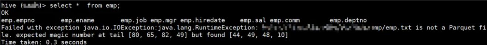
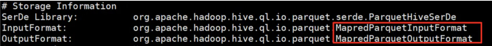

[TOC]
# hive存储parquet表
## 数据准备
emp.txt
```
7369,smith,clerk,7902,2010-12-17,800,,20
7499,allen,salesman,7698,2011-02-20,1600,300,30
7521,ward,salesman,7698,2011-02-22,1250,500,30
7566,jones,manager,7839,2011-04-02,2975,,20
7654,martin,salesman,7698,2011-09-28,1250,1400,30
7698,blake,manager,7839,2011-05-01,2850,,30
7782,clark,manager,7839,2011-06-09,2450,,10
7788,scott,analyst,7566,2017-07-13,3000,,20
7839,king,president,,2011-11-07,5000,,10
7844,turner,salesman,7698,2011-09-08,1500,0,30
7876,adams,clerk,7788,2017-07-13,1100,,20
7900,james,clerk,7698,2011-12-03,950,,30
7902,ford,analyst,7566,2011-12-03,3000,,20
7934,miller,clerk,7782,2012-01-23,1300,,10
```

```sql
-- 创建 parquet 表
CREATE TABLE emp (
  empno int,
  ename string,
  job string,
  mgr int,
  hiredate DATE,
  sal int,
  comm int,
  deptno int
)row format delimited fields terminated by ","
stored as PARQUET;

-- 加载数据
load data local inpath '/home/zhou/data/emp.txt' into table emp;

-- 查询数据
select * from emp;
```

结果报错了


## 分析
我们看一下emp的相关信息,可以看到这里的都是parquet的format
```sql
desc formatted emp;
```

emp使用parquet格式存储，其中imputFormat和outputFormat都是parquet的相关的，也就是我的imputFormat是parquent的，但是你传过来的是text，我不认识

## 解决
```sql
-- 第一步 创建临时表
CREATE TABLE emp_tmp (
  empno int,
  ename string,
  job string,
  mgr int,
  hiredate DATE,
  sal int,
  comm int,
  deptno int
)row format delimited fields terminated by ",";
-- 第二步 加载数据到临时表
load data local inpath '/home/zhou/data/emp.txt' into table emp_tmp;
-- 第三步 同步数据到 parquet 表
insert overwrite table emp select *  from emp_tmp;

-- 查询数据
select * from emp 可以正常读取数据了
```

## 参考地址
[hive存储parquet表](https://www.jianshu.com/p/20a15edee7a0)

