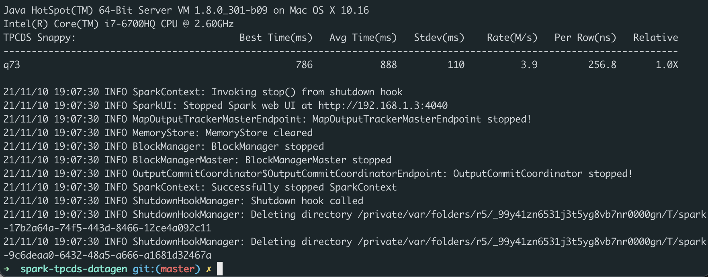
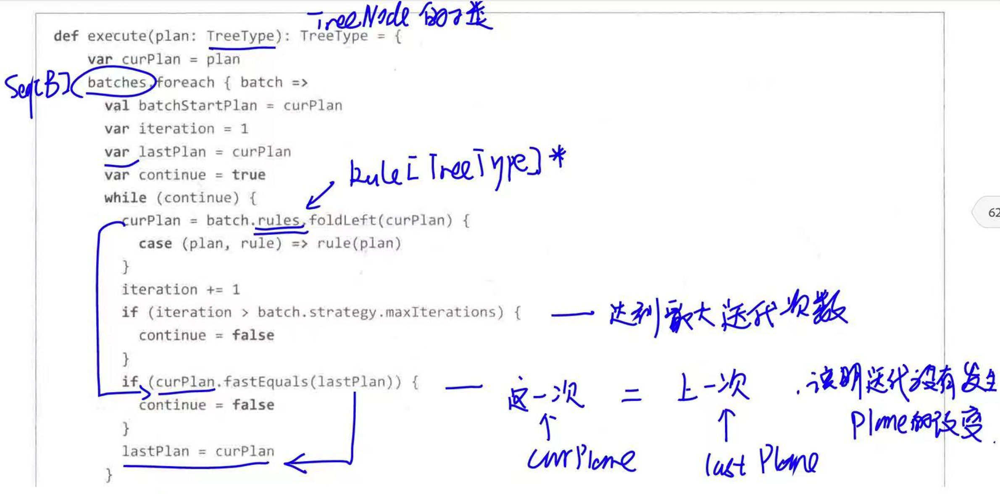

# 分析一条 TPCDS SQL
## 操作环境
```
mac book `macOS Catalina` version `10.15.7`
```
## 什么是 TPCDS
针对数据库不同的使用场景TPC组织发布了多项测试标准。其中被业界广泛接受和使用的有TPC-C 、TPC-H和TPC-DS。

#### TPC-C
TPC-C于1992年7月获得批准，是针对OLTP的基准测试。目前针对MySQL，Percona仍然提供TPC-C测试包。

#### TPC-H
TPC-H是决策支持的基准测试。它由一套面向业务的即席查询和并发数据修改组成。TPC-H基准的数据库模式遵循第三范式。
**问题**新兴的数据仓库开始采用新的模型，如星型模型、雪花模型。TPC-H已经不能精准反映当今数据库系统的真实性能。为此，TPC组织推出了新一代的面向决策应用的TPC-DS 基准。

#### TPC-DS
TPC-DS是决策支持的基本测试，提供了决策支持系统的通用见面方式，包括数据查询和数据维护。

TPC-DS基准测试提供:
1. 通用决策支持系统的性能评估。
2. 基准测试的结果衡量了单用户模式下的响应时间，多用户模式下的查询吞吐量，特定操作系统和硬件的数据维护性能，在受限复杂的环境下数据处理系统、支持多用户决策。

TPC-DS v2则支持新兴技术如大数据 进行性能测试。tpc.org 官方也提供规范和测试包。

TPC-DS采用星型、雪花型等多维数据模式。它包含7张事实表，17张纬度表平均每张表含有18列。其工作负载包含99个SQL查询，覆盖SQL99和2003的核心部分以及OLAP。这个测试集包含对大数据集的统计、报表生成、联机查询、数据挖掘等复杂应用，测试用的数据和值是有倾斜的，与真实数据一致。可以说TPC-DS是与真实场景非常接近的一个测试集，也是难度较大的一个测试集。

#### 结论
TPC-C是针对OLTP的测试，TPC-H和TPC-DS则是针对OLAP的测试
#### 参考链接
[数据库基准测试标准 TPC-C or TPC-H or TPC-DS](https://www.jianshu.com/p/2a949b6fb2ca)

## 什么是spark-tpcds-datagen
spark-tpcds-datagen is a TPCDS data generator for Apache Spark, which is split off from spark-sql-perf and includes pre-built tpcds-kit for Mac/Linux x86_64 platforms.

## 操作步骤
```
1. 从 github 下载 TPCDS 数据生成器
>git clone https://github.com/maropu/spark-tpcds-datagen.git 
>cd spark-tpcds-datagen

2. 下载 Spark3.1.1 到 spark-tpcds-datagen 目录并解压
>wget https://archive.apache.org/dist/spark/spark-3.1.1/spark-3.1.1-bin-hadoop2.7.tgz
>tar -zxvf spark-3.1.1-bin-hadoop2.7.tgz

3. 生成数据
>mkdir -p tpcds-data-1g
>export SPARK_HOME=./spark-3.1.1-bin-hadoop2.7
>./bin/dsdgen --output-location tpcds-data-1g

4. 下载三个 test jar 并放到当前目录
>wget https://repo1.maven.org/maven2/org/apache/spark/spark-catalyst_2.12/3.1.1/spark-catalyst_2.12-3.1.1-tests.jar
>wget https://repo1.maven.org/maven2/org/apache/spark/spark-core_2.12/3.1.1/spark-core_2.12-3.1.1-tests.jar
>wget https://repo1.maven.org/maven2/org/apache/spark/spark-sql_2.12/3.1.1/spark-sql_2.12-3.1.1-tests.jar

5.执行 SQL
./spark-3.1.1-bin-hadoop2.7/bin/spark-submit  —class
org.apache.spark.sql.execution.benchmark.TPCDSQueryBenchmark  —jars
spark-core_2.12-3.1.1-tests.jar,spark-catalyst_2.12-3.1.1-tests.jar 
spark-sql_2.12-3.1.1-tests.jar --data-location tpcds-data-1g --query-filter "q73" 
```
[github-spark-tpcds-datagen-readme](https://github.com/maropu/spark-tpcds-datagen)

## 分析结果
### sql-73
```sql
SELECT
  c_last_name,
  c_first_name,
  c_salutation,
  c_preferred_cust_flag,
  ss_ticket_number,
  cnt
FROM
  (SELECT
    ss_ticket_number,
    ss_customer_sk,
    count(*) cnt
  FROM store_sales, date_dim, store, household_demographics
  WHERE store_sales.ss_sold_date_sk = date_dim.d_date_sk
    AND store_sales.ss_store_sk = store.s_store_sk
    AND store_sales.ss_hdemo_sk = household_demographics.hd_demo_sk
    AND date_dim.d_dom BETWEEN 1 AND 2
    AND (household_demographics.hd_buy_potential = '>10000' OR
    household_demographics.hd_buy_potential = 'unknown')
    AND household_demographics.hd_vehicle_count > 0
    AND CASE WHEN household_demographics.hd_vehicle_count > 0
    THEN
      household_demographics.hd_dep_count / household_demographics.hd_vehicle_count
        ELSE NULL END > 1
    AND date_dim.d_year IN (1999, 1999 + 1, 1999 + 2)
    AND store.s_county IN ('Williamson County', 'Franklin Parish', 'Bronx County', 'Orange County')
  GROUP BY ss_ticket_number, ss_customer_sk) dj, customer
WHERE ss_customer_sk = c_customer_sk
  AND cnt BETWEEN 1 AND 5
ORDER BY cnt DESC
```
[sql-github](https://github.com/apache/spark/tree/master/sql/core/src/test/resources/tpcds)

### 运行结果

### 收集日志
优化一下 执行 SQL 的语句, ` > q73.log 2>&1`将日志打印到当前目录下的`q73.log` , `--conf spark.sql.planChangeLog.level=WARN` 执行日志的 level 设置为 warn 
```
./spark-3.1.1-bin-hadoop2.7/bin/spark-submit --conf spark.sql.planChangeLog.level=WARN --class org.apache.spark.sql.execution.benchmark.TPCDSQueryBenchmark --jars spark-core_2.12-3.1.1-tests.jar,spark-catalyst_2.12-3.1.1-tests.jar spark-sql_2.12-3.1.1-tests.jar --data-location tpcds-data-1g --query-filter "q73"  > q73.log 2>&1
```

## 分析日志
**问题:该 SQL 用到了哪些优化规则(optimizer rules)**
1. Analyzer
> 1. ResolveRelations
> 2. CleanupAliases
> 3. EliminateSubqueryAliases

2. optimizer
> 1. ColumnPruning

3. prepareForExecution
> 1. EnsureRequirements
> 2. ApplyColumnarRulesAndInsertTransitions
> 3. CollapseCodegenStages

### 优化规则简要说明
1. ResolveRelations
该规则代码中的注释
```scala
  /**
   * Replaces [[UnresolvedRelation]]s with concrete relations from the catalog.  
   */
   
  /**
   * 用catalog中的具体关系替换 [[UnresolvedRelation]]s。
   */
```
**作用:** ResolveRelations规则用来解析 sql 语句中的表. 将`'UnresolvedRelation [catalog_page]` 变为`Relation[cp_catalog_page_sk#0,cp_catalog_page_id#1,cp_start_date_sk#2,cp_end_date_sk#3,cp_department#4,cp_catalog_number#5,cp_catalog_page_number#6,cp_description#7,cp_type#8] parquet`. 通过 catalog 解析数据源

分析 `Relation[cp_catalog_page_sk#0 ... ,cp_type#8] parquet` 
* 发现 `[]` 中包含 `catalog_page`表中的字段, 例如 `cp_catalog_page_sk#0`,`cp_catalog_page_id#1`
* `cp_catalog_page_sk`为字段名 `#0`为catalyst添加的唯一标识 id,这样如果 join sql 语句俩个表中有同名的字段,  也不会弄混.
*  `parquet` 说明了数据源的格式

**具体执行** 
* `Analyzer` 继承自 `ruleExecutor` . `Analyzer` 包含一个变量 `batches` , 它的父类包含一个`execute`方法. 通过程序的入口函数 `sparkSession 的 sql函数`会最终调用父类(`ruleExecutor`) 的`execute`方法

```scala
 //1.sparkSession
  def sql(sqlText: String): DataFrame = withActive {
    val tracker = new QueryPlanningTracker
    val plan = tracker.measurePhase(QueryPlanningTracker.PARSING) {
      sessionState.sqlParser.parsePlan(sqlText)
    }
    Dataset.ofRows(self, plan, tracker) //深入查看
  }
 //2.dataset
  def ofRows(sparkSession: SparkSession, logicalPlan: LogicalPlan, tracker: QueryPlanningTracker)
    : DataFrame = sparkSession.withActive {
    val qe = new QueryExecution(sparkSession, logicalPlan, tracker)
    qe.assertAnalyzed() //深入查看
    new Dataset[Row](qe, RowEncoder(qe.analyzed.schema))
  }
 //3.queryExecution
  def assertAnalyzed(): Unit = analyzed //深入查看
    
 //4.queryExecution
  lazy val analyzed: LogicalPlan = executePhase(QueryPlanningTracker.ANALYSIS) {
    // We can't clone `logical` here, which will reset the `_analyzed` flag.
    sparkSession.sessionState.analyzer.executeAndCheck(logical, tracker)//深入查看
  }
  
 //5.analyzer
  def executeAndCheck(plan: LogicalPlan, tracker: QueryPlanningTracker): LogicalPlan = {
    if (plan.analyzed) return plan
    AnalysisHelper.markInAnalyzer {
      val analyzed = executeAndTrack(plan, tracker)//深入查看
      try {
        checkAnalysis(analyzed)
        analyzed
      } catch {
        case e: AnalysisException =>
          val ae = new AnalysisException(e.message, e.line, e.startPosition, Option(analyzed))
          ae.setStackTrace(e.getStackTrace)
          throw ae
      }
    }
  }
  
 //6.  ruleExecutor
  /**
   * Executes the batches of rules defined by the subclass, and also tracks timing info for each
   * rule using the provided tracker.
   * @see [[execute]]
   */
  def executeAndTrack(plan: TreeType, tracker: QueryPlanningTracker): TreeType = {
    QueryPlanningTracker.withTracker(tracker) {
      execute(plan)
    }
```

接着看看 execute 方法中干了什么?
spark 2.1的 `execute` 方法, 因为 spark2.1的代码比较好理解. 
注意: 文章中除了此处的代码为 spark2.1版本, 其他的版本均为 spark3.2.1版本

从代码可以看见 `execute` 方法,遍历`batches`
先看看什么是`batch` ?

```scala
// ruleExecutor
  /** A strategy that is run once and idempotent. */
  case object Once extends Strategy { val maxIterations = 1 }

  /**
   * A strategy that runs until fix point or maxIterations times, whichever comes first.
   * Especially, a FixedPoint(1) batch is supposed to run only once.
   */
  case class FixedPoint(
    override val maxIterations: Int,
    override val errorOnExceed: Boolean = false,
    override val maxIterationsSetting: String = null) extends Strategy

  /** A batch of rules. */
  protected case class Batch(name: String, strategy: Strategy, rules: Rule[TreeType]*)
```
* batch 由 `name` String 类型
* 由 `strategy`,且 strategy 有俩个子类 `Once` 和 `FixedPoint` , once 只遍历一次 fixedpoint 可以指定遍历次数, 默认为100次
* 由`rules`一系列的 `Rule[LogicalPlan]`组成

什么时候遍历会结束?
* 当该 batch 达到指定的遍历次数
* 也有没有达到指定次数但是提前退出的情况, 当优化过后的逻辑计划 和 执行优化规则之前的逻辑计划一样的时候, 会提前退出

规则是如何被应用到 逻辑计划上的呢?
`execute` 方法中的`rule(plan)`会调用 具体规则中的`apply` 方法
```scala
curPlan = batch.rules.foldLeft(curPlan) {
          case (plan, rule) => rule(plan)
}
```

ResolveRelations 规则
```scala
  object ResolveRelations extends Rule[LogicalPlan] {

    def apply(plan: LogicalPlan): LogicalPlan = ResolveTempViews(plan).resolveOperatorsUp {
      case i @ InsertIntoStatement(table, _, _, _, _, _) if i.query.resolved =>
        val relation = table match {
          case u @ UnresolvedRelation(_, _, false) =>
            lookupRelation(u.multipartIdentifier, u.options, false).getOrElse(u)
          case other => other
        }

        EliminateSubqueryAliases(relation) match {
          case v: View =>
            table.failAnalysis(s"Inserting into a view is not allowed. View: ${v.desc.identifier}.")
          case other => i.copy(table = other)
        }

      // TODO (SPARK-27484): handle streaming write commands when we have them.
      case write: V2WriteCommand =>
        write.table match {
          case u: UnresolvedRelation if !u.isStreaming =>
            lookupRelation(u.multipartIdentifier, u.options, false)
              .map(EliminateSubqueryAliases(_))
              .map {
                case v: View => write.failAnalysis(
                  s"Writing into a view is not allowed. View: ${v.desc.identifier}.")
                case u: UnresolvedCatalogRelation => write.failAnalysis(
                  "Cannot write into v1 table: " + u.tableMeta.identifier)
                case r: DataSourceV2Relation => write.withNewTable(r)
                case other => throw new IllegalStateException(
                  "[BUG] unexpected plan returned by `lookupRelation`: " + other)
              }.getOrElse(write)
          case _ => write
        }

      case u: UnresolvedRelation =>
        lookupRelation(u.multipartIdentifier, u.options, u.isStreaming)
          .map(resolveViews).getOrElse(u)

      case u @ UnresolvedTable(identifier, cmd) =>
        lookupTableOrView(identifier).map {
          case v: ResolvedView =>
            val viewStr = if (v.isTemp) "temp view" else "view"
            u.failAnalysis(s"${v.identifier.quoted} is a $viewStr. '$cmd' expects a table.")
          case table => table
        }.getOrElse(u)

      case u @ UnresolvedTableOrView(identifier, _, _) =>
        lookupTableOrView(identifier).getOrElse(u)
    }
  }
```
`ResolveTempViews(plan)`返回一个`LogicalPlan`, 且不是重点, 就忽略不细看了
`resolveOperatorsUp` 方法接收一个偏函数`PartialFunction[LogicalPlan, LogicalPlan]` 返回一个 `LogicalPlan`, `resolveOperatorsUp`会将偏函数递归调用应用于整棵树的每个节点, 偏函数主要进行模式匹配, 就这个 sql-73而言, 会匹配到
```
      case u: UnresolvedRelation =>
        lookupRelation(u.multipartIdentifier, u.options, u.isStreaming)
          .map(resolveViews).getOrElse(u)
```
`lookupRelation`会一直调用到parquet 文件所在的数据源处, 将`UnresolvedRelation` 装换为 `Relation`. 

2. ColumnPruning
该规则代码中的注释
```
/**
 * Attempts to eliminate the reading of unneeded columns from the query plan.
 *
 * Since adding Project before Filter conflicts with PushPredicatesThroughProject, this rule will
 * remove the Project p2 in the following pattern:
 *
 *   p1 @ Project(_, Filter(_, p2 @ Project(_, child))) if p2.outputSet.subsetOf(p2.inputSet)
 *
 * p2 is usually inserted by this rule and useless, p1 could prune the columns anyway.
 */
 
 /**
 * 尝试从查询计划中消除不需要的列的读取。
 *
 * 由于在过滤器之前添加项目与 PushPredicatesThroughProject 冲突，此规则将按以下
 * 模式删除项目 p2：
 *
 *   p1 @ Project(_, Filter(_, p2 @ Project(_, child))) if p2.outputSet.subsetOf(p2.inputSet)
 *
 * p2 通常包含这条规则插入并且没用，p1 无论如何都可以修剪列。
 */
```
**作用** 从查询计划中消除不需要的列的读取。
但是对比日志发现 并没有任何一个列被消除了
`!+- Relation[cp_catalog_page_sk#0,cp_catalog_page_id#1,cp_start_date_sk#2,cp_end_date_sk#3,cp_department#4,cp_catalog_number#5,cp_catalog_page_number#6,cp_description#7,cp_type#8] parquet ` 
`! +- Relation[cp_catalog_page_sk#0,cp_catalog_page_id#1,cp_start_date_sk#2,cp_end_date_sk#3,cp_department#4,cp_catalog_number#5,cp_catalog_page_number#6,cp_description#7,cp_type#8] parquet`

### 优化规则摘要
#### Analyzer
##### ResolveRelations
```scala
=== Applying Rule org.apache.spark.sql.catalyst.analysis.Analyzer$ResolveRelations ===
!'UnresolvedRelation [catalog_page], [], false   SubqueryAlias catalog_page
!                                                +- Relation[cp_catalog_page_sk#0,cp_catalog_page_id#1,cp_start_date_sk#2,cp_end_date_sk#3,cp_department#4,cp_catalog_number#5,cp_catalog_page_number#6,cp_description#7,cp_type#8] parquet
           
21/11/10 18:58:56 WARN PlanChangeLogger: 
=== Result of Batch Resolution ===
!'UnresolvedRelation [catalog_page], [], false   SubqueryAlias catalog_page
!                                                +- Relation[cp_catalog_page_sk#0,cp_catalog_page_id#1,cp_start_date_sk#2,cp_end_date_sk#3,cp_department#4,cp_catalog_number#5,cp_catalog_page_number#6,cp_description#7,cp_type#8] parquet
```

##### CleanupAliases
```scala
=== Applying Rule org.apache.spark.sql.catalyst.analysis.CleanupAliases ===
 Aggregate [count(1) AS count#37L]                                                                                                                                                               Aggregate [count(1) AS count#37L]
 +- SubqueryAlias catalog_page                                                                                                                                                                   +- SubqueryAlias catalog_page
    +- Relation[cp_catalog_page_sk#0,cp_catalog_page_id#1,cp_start_date_sk#2,cp_end_date_sk#3,cp_department#4,cp_catalog_number#5,cp_catalog_page_number#6,cp_description#7,cp_type#8] parquet      +- Relation[cp_catalog_page_sk#0,cp_catalog_page_id#1,cp_start_date_sk#2,cp_end_date_sk#3,cp_department#4,cp_catalog_number#5,cp_catalog_page_number#6,cp_description#7,cp_type#8] parquet
```

##### EliminateSubqueryAliases
```scala
=== Applying Rule org.apache.spark.sql.catalyst.analysis.EliminateSubqueryAliases ===
 Aggregate [count(1) AS count#37L]                                                                                                                                                               Aggregate [count(1) AS count#37L]
!+- SubqueryAlias catalog_page                                                                                                                                                                   +- Relation[cp_catalog_page_sk#0,cp_catalog_page_id#1,cp_start_date_sk#2,cp_end_date_sk#3,cp_department#4,cp_catalog_number#5,cp_catalog_page_number#6,cp_description#7,cp_type#8] parquet
!   +- Relation[cp_catalog_page_sk#0,cp_catalog_page_id#1,cp_start_date_sk#2,cp_end_date_sk#3,cp_department#4,cp_catalog_number#5,cp_catalog_page_number#6,cp_description#7,cp_type#8] parquet   
```

#### optimizer
##### ColumnPruning
```scala
=== Applying Rule org.apache.spark.sql.catalyst.optimizer.ColumnPruning ===
 Aggregate [count(1) AS count#37L]                                                                                                                                                            Aggregate [count(1) AS count#37L]
!+- Relation[cp_catalog_page_sk#0,cp_catalog_page_id#1,cp_start_date_sk#2,cp_end_date_sk#3,cp_department#4,cp_catalog_number#5,cp_catalog_page_number#6,cp_description#7,cp_type#8] parquet   +- Project
!                                                                                                                                                                                                +- Relation[cp_catalog_page_sk#0,cp_catalog_page_id#1,cp_start_date_sk#2,cp_end_date_sk#3,cp_department#4,cp_catalog_number#5,cp_catalog_page_number#6,cp_description#7,cp_type#8] parquet
```

#### prepareForExecution
##### EnsureRequirements
```scala
=== Applying Rule org.apache.spark.sql.execution.exchange.EnsureRequirements ===
 HashAggregate(keys=[], functions=[count(1)], output=[count#37L])                                                                                                                                                                                           HashAggregate(keys=[], functions=[count(1)], output=[count#37L])
!+- HashAggregate(keys=[], functions=[partial_count(1)], output=[count#40L])                                                                                                                                                                                +- Exchange SinglePartition, ENSURE_REQUIREMENTS, [id=#13]
!   +- FileScan parquet [] Batched: true, DataFilters: [], Format: Parquet, Location: InMemoryFileIndex[file:/Users/saya/Documents/08-BIG-DATA/08-test/spark-tpcds-datagen/tpcds-data-1..., PartitionFilters: [], PushedFilters: [], ReadSchema: struct<>      +- HashAggregate(keys=[], functions=[partial_count(1)], output=[count#40L])
!                                                                                                                                                                                                                                                                 +- FileScan parquet [] Batched: true, DataFilters: [], Format: Parquet, Location: InMemoryFileIndex[file:/Users/saya/Documents/08-BIG-DATA/08-test/spark-tpcds-datagen/tpcds-data-1..., PartitionFilters: [], PushedFilters: [], ReadSchema: struct<>
```

##### ApplyColumnarRulesAndInsertTransitions
```scala
21/11/10 18:58:57 WARN PlanChangeLogger: 
=== Applying Rule org.apache.spark.sql.execution.ApplyColumnarRulesAndInsertTransitions ===
 HashAggregate(keys=[], functions=[count(1)], output=[count#37L])                                                                                                                                                                                              HashAggregate(keys=[], functions=[count(1)], output=[count#37L])
!+- Exchange SinglePartition, ENSURE_REQUIREMENTS, [id=#13]                                                                                                                                                                                                    +- Exchange SinglePartition, ENSURE_REQUIREMENTS, [id=#17]
    +- HashAggregate(keys=[], functions=[partial_count(1)], output=[count#40L])                                                                                                                                                                                   +- HashAggregate(keys=[], functions=[partial_count(1)], output=[count#40L])
!      +- FileScan parquet [] Batched: true, DataFilters: [], Format: Parquet, Location: InMemoryFileIndex[file:/Users/saya/Documents/08-BIG-DATA/08-test/spark-tpcds-datagen/tpcds-data-1..., PartitionFilters: [], PushedFilters: [], ReadSchema: struct<>         +- ColumnarToRow
!                                                                                                                                                                                                                                                                       +- FileScan parquet [] Batched: true, DataFilters: [], Format: Parquet, Location: InMemoryFileIndex[file:/Users/saya/Documents/08-BIG-DATA/08-test/spark-tpcds-datagen/tpcds-data-1..., PartitionFilters: [], PushedFilters: [], ReadSchema: struct<>
```

##### CollapseCodegenStages
```scala
21/11/10 18:58:57 WARN PlanChangeLogger: 
=== Applying Rule org.apache.spark.sql.execution.CollapseCodegenStages ===
!HashAggregate(keys=[], functions=[count(1)], output=[count#37L])                                                                                                                                                                                                 *(2) HashAggregate(keys=[], functions=[count(1)], output=[count#37L])
!+- Exchange SinglePartition, ENSURE_REQUIREMENTS, [id=#17]                                                                                                                                                                                                       +- Exchange SinglePartition, ENSURE_REQUIREMENTS, [id=#23]
!   +- HashAggregate(keys=[], functions=[partial_count(1)], output=[count#40L])                                                                                                                                                                                      +- *(1) HashAggregate(keys=[], functions=[partial_count(1)], output=[count#40L])
!      +- ColumnarToRow                                                                                                                                                                                                                                                 +- *(1) ColumnarToRow
          +- FileScan parquet [] Batched: true, DataFilters: [], Format: Parquet, Location: InMemoryFileIndex[file:/Users/saya/Documents/08-BIG-DATA/08-test/spark-tpcds-datagen/tpcds-data-1..., PartitionFilters: [], PushedFilters: [], ReadSchema: struct<>            +- FileScan parquet [] Batched: true, DataFilters: [], Format: Parquet, Location: InMemoryFileIndex[file:/Users/saya/Documents/08-BIG-DATA/08-test/spark-tpcds-datagen/tpcds-data-1..., PartitionFilters: [], PushedFilters: [], ReadSchema: struct<>
```

