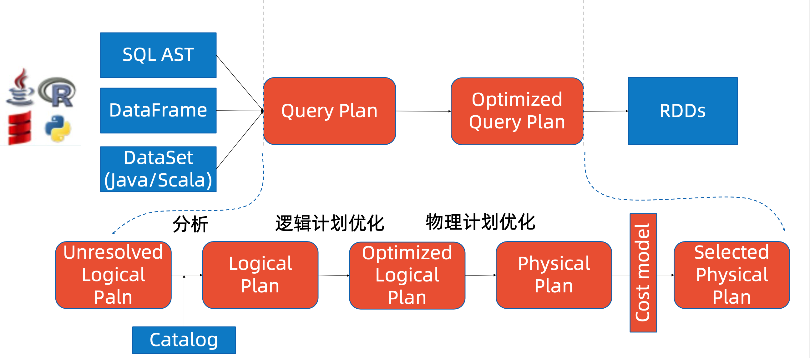
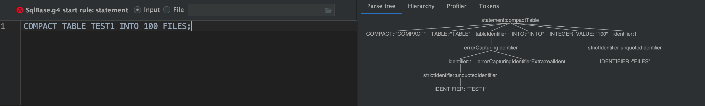
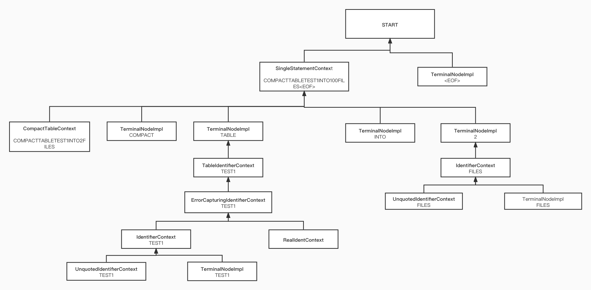

## 集群环境
```
mac book `macOS Catalina` version `10.15.7`
antlr version `4.9.1`
spark version `3.1.2`
java version `1.8.0_291`
scala version `2.12.10`
```
## sql 解析过程


## 思路
`COMPACT TABLE test1 INTO 500 FILES;` 并不是查询语句, 而是一种DDL语句.
可以参考 `ALERT TABLE`命令来编写`COMPACT TABLE`.

```
| ALTER (TABLE | VIEW) multipartIdentifier ADD (IF NOT EXISTS)?
        partitionSpecLocation+                                         #addTablePartition
```
可以参考 [学习alterTable解析过程](./学习alterTable解析过程.md)

1. 由`为Spark SQL添加一条自定义命令`作业和老师给的提示`| COMPACT TABLE target=tableIdentifier partitionSpec? (INTO fileNum=INTEGER_VALUE identifier)? #compactTable` 可以知道如何从 sql 语句到AST tree.
2. 在从参考`ALERT TABLE` 可以生成unsolved  logical plan. 
3. 目前无法得知如何从unsolved logical plan 到solved logical plan, 需要拿到solved logical plan, 才可以知道待合并的小文件地址,  可以研读 `Spark SQL内核剖析`一书. 
4. 拿到数据之后, 通过`coalesce`缩小分区数量, 并通过`saveAsTable`保存到 table


## parse
#### 使用环境
```
antlr version `4.9.1`
```
使用语法定义如下
`| COMPACT TABLE target=tableIdentifier partitionSpec? (INTO fileNum=INTEGER_VALUE identifier)? #compactTable`

#### compact table 产生的 AST tree
SQL STATEMENT: `Compact table test1 into 2 files;`


```
1|-  org.apache.spark.sql.catalyst.parser.SqlBaseParser.SingleStatementContext  Compacttabletest1into2files<EOF>
2|--  org.apache.spark.sql.catalyst.parser.SqlBaseParser.CompactTableContext  Compacttabletest1into2files
2|---  org.antlr.v4.runtime.tree.TerminalNodeImpl  Compact
2|---  org.antlr.v4.runtime.tree.TerminalNodeImpl  table
3|---  org.apache.spark.sql.catalyst.parser.SqlBaseParser.TableIdentifierContext  test1
4|----  org.apache.spark.sql.catalyst.parser.SqlBaseParser.ErrorCapturingIdentifierContext  test1
5|-----  org.apache.spark.sql.catalyst.parser.SqlBaseParser.IdentifierContext  test1
6|------  org.apache.spark.sql.catalyst.parser.SqlBaseParser.UnquotedIdentifierContext  test1
6|-------  org.antlr.v4.runtime.tree.TerminalNodeImpl  test1
5|-----  org.apache.spark.sql.catalyst.parser.SqlBaseParser.RealIdentContext
2|---  org.antlr.v4.runtime.tree.TerminalNodeImpl  into
2|---  org.antlr.v4.runtime.tree.TerminalNodeImpl  2
3|---  org.apache.spark.sql.catalyst.parser.SqlBaseParser.IdentifierContext  files
4|----  org.apache.spark.sql.catalyst.parser.SqlBaseParser.UnquotedIdentifierContext  files
4|-----  org.antlr.v4.runtime.tree.TerminalNodeImpl  files
1|--  org.antlr.v4.runtime.tree.TerminalNodeImpl  <EOF>
```


#### 步骤
1. 修改 sqlBase.g4文件 在 statement 处添加(添加在 sqlBase.g4中的compact table 命令略微优化)
**老师版本**
```
| COMPACT TABLE target=tableIdentifier partitionSpec? (INTO fileNum=INTEGER_VALUE identifier)? #compactTable
```
**优化版本**
```
| COMPACT TABLE (IF EXISTS)? multipartIdentifier partitionSpec? (INTO fileNum=INTEGER_VALUE identifier)?   #compactTable
```
添加`(IF EXISTS)?` 用于判断是否存在目标 table
`target=tableIdentifier` 改为 `multipartIdentifier`
2. 编译生成 sqlBase.g4文件, generate Code, 具体步骤可参考[ 为Spark SQL添加一条自定义命令](../../../06/RESULT/01/readme.md) 文档

3. 添加 sparkSqlParser.scala 文件中添加 visit 方法
```
  override def visitCompactTable(ctx: CompactTableContext): LogicalPlan = withOrigin(ctx) {
    CompactTableCommand(
      visitMultipartIdentifier(ctx.multipartIdentifier),
      ctx.INTEGER_VALUE.getText.toInt,
      ctx.EXISTS != null);
  }
```
4. compactTable 方法继承自 RunableCommand
```
/*
 * Licensed to the Apache Software Foundation (ASF) under one or more
 * contributor license agreements.  See the NOTICE file distributed with
 * this work for additional information regarding copyright ownership.
 * The ASF licenses this file to You under the Apache License, Version 2.0
 * (the "License"); you may not use this file except in compliance with
 * the License.  You may obtain a copy of the License at
 *
 *    http://www.apache.org/licenses/LICENSE-2.0
 *
 * Unless required by applicable law or agreed to in writing, software
 * distributed under the License is distributed on an "AS IS" BASIS,
 * WITHOUT WARRANTIES OR CONDITIONS OF ANY KIND, either express or implied.
 * See the License for the specific language governing permissions and
 * limitations under the License.
 */

package org.apache.spark.sql.execution.command

import org.apache.spark.sql.{AnalysisException, DataFrame, Row, SparkSession}
import org.apache.spark.sql.catalyst.TableIdentifier


case class CompactTableCommand(
                                tableIdentifier: TableIdentifier,
                                fileNum: Int,
                                ifExists: Boolean) extends RunnableCommand {

  override def run(sparkSession: SparkSession): Seq[Row] = {
    val tableName = tableIdentifier.identifier

    sparkSession.table(tableName) match {
      case dataFrame: DataFrame =>
        dataFrame.coalesce(fileNum).write
          .mode("overwrite")
          .saveAsTable(tableName)
      case _ => throw new AnalysisException("Table or view not found")
    }
    Seq.empty[Row]
  }
}
```

#### 测试代码
无需在集群环境中测试, 直接可以本地测试

步骤
```
1. 编译
./build/sbt package -Phive -Phive-thriftserver -DskipTests

2. 运行
./bin/spark-sql

3. 添加表和数据, 在 spark-sql 命令中执行
spark sql>  create table student(id bigint,name string) partitioned by (age int) row format delimited fields terminated by ',' stored as textfile ;

spark sql> set hive.exec.dynamic.partition.mode=nonstrict;

spark sql>  insert into student (id, name, age) values(1, 'a', 10);
spark sql>  insert into student (id, name, age ) values(2, 'a', 20);
spark sql>  insert into student (id, name, age ) values(3, 'a', 30);
spark sql>  insert into student (id, name, age ) values(4, 'a', 40);
spark sql>  insert into student (id, name, age ) values(5, 'a', 50);
spark sql>  insert into student (id, name, age ) values(6, 'a', 60);
spark sql>  insert into student (id, name, age ) values(7, 'a',70);
spark sql>  insert into student (id, name, age ) values(8, 'a', 80);

spark-sql> show partitions student;
age=10
age=20
age=30
age=40
age=50
age=60
age=70
age=80

spark-sql> compact table student into 1 files;
```

#### 问题 - 一
```
spark-sql> compact table student into 1 files;
Error in query: Cannot overwrite table default.student that is also being read from
```

#### 优化代码 - 一
`Option(ctx.INTEGER_VALUE.getText)` 参数改为可选
```scala
  override def visitCompactTable(ctx: CompactTableContext): LogicalPlan = withOrigin(ctx) {
    CompactTableCommand(
      visitTableIdentifier(ctx.tableIdentifier),
      Option(ctx.INTEGER_VALUE.getText),
      ctx.EXISTS != null);
  }
```
先overwrite 到 temp table
```scala
/*
 * Licensed to the Apache Software Foundation (ASF) under one or more
 * contributor license agreements.  See the NOTICE file distributed with
 * this work for additional information regarding copyright ownership.
 * The ASF licenses this file to You under the Apache License, Version 2.0
 * (the "License"); you may not use this file except in compliance with
 * the License.  You may obtain a copy of the License at
 *
 *    http://www.apache.org/licenses/LICENSE-2.0
 *
 * Unless required by applicable law or agreed to in writing, software
 * distributed under the License is distributed on an "AS IS" BASIS,
 * WITHOUT WARRANTIES OR CONDITIONS OF ANY KIND, either express or implied.
 * See the License for the specific language governing permissions and
 * limitations under the License.
 */

package org.apache.spark.sql.execution.command

import org.apache.spark.sql.{AnalysisException, DataFrame, Row, SparkSession}
import org.apache.spark.sql.catalyst.TableIdentifier
import org.apache.spark.sql.catalyst.expressions.{Attribute, AttributeReference}
import org.apache.spark.sql.types.StringType


case class CompactTableCommand(
                                table: TableIdentifier,
                                fileNum: Option[String],
                                ifExists: Boolean) extends RunnableCommand {

  private val defaultSize = 128 * 1024 * 1024

  override def output: Seq[Attribute] = Seq(
    AttributeReference("COMPACT_TABLE", StringType, nullable = false)()
  )

  override def run(sparkSession: SparkSession): Seq[Row] = {

    sparkSession.catalog.setCurrentDatabase(table.database.getOrElse("default"))

    val tempTableName: String = "`" + table.identifier + "_" + System.currentTimeMillis() + "`"

    def repartitionInTempTable(): Unit = {
      val originDataFrame = sparkSession.table(table.identifier)

      val partitions = fileNum match {
        case Some(files) => files.toInt
        case None => (sparkSession.sessionState
          .executePlan(originDataFrame.queryExecution.logical)
          .optimizedPlan.stats.sizeInBytes / defaultSize).toInt + 1
      }

      originDataFrame match {
        case dataFrame: DataFrame =>
          dataFrame.repartition(partitions).write
            .mode("overwrite")
            .saveAsTable(tempTableName)
        case _ => throw new AnalysisException("Table or view not found")
      }
    }

    def writeBack(): Unit = {
      sparkSession.table(tempTableName)
        .write
        .mode("overwrite")
        .saveAsTable(table.identifier)
    }

    repartitionInTempTable
    writeBack

    Seq.empty[Row]
  }
}
```

#### 问题-二 overwrite 之后变为非分区表
```
spark-sql>  show partitions student;
age=10
age=20
age=30
age=40
age=50
age=60
age=70
age=80
spark-sql> desc student;
id	bigint	NULL
name	string	NULL
age	int	NULL
# Partition Information
# col_name	data_type	comment
age	int	NULL


spark-sql> compact table student into 2 files;
spark-sql> desc student;
id	bigint	NULL
name	string	NULL
age	int	NULL
```

#### 优化代码-二
```
```

#### inject parser

[ANTRL 自定义解析](https://www.jianshu.com/p/9122814dccd8)

## 其他
### 实现思路借鉴UncacheTableCommand
```
//SparkSqlParser.scala
  /**
   * Create an [[UncacheTableCommand]] logical plan.
   */
  override def visitUncacheTable(ctx: UncacheTableContext): LogicalPlan = withOrigin(ctx) {
    UncacheTableCommand(
      visitMultipartIdentifier(ctx.multipartIdentifier),
      ctx.EXISTS != null)
  }

//实现
case class UncacheTableCommand(
    multipartIdentifier: Seq[String],
    ifExists: Boolean) extends RunnableCommand {

  override def run(sparkSession: SparkSession): Seq[Row] = {
    val tableName = multipartIdentifier.quoted
    table(sparkSession, tableName).foreach { table =>
      val cascade = !sparkSession.sessionState.catalog.isTempView(multipartIdentifier)
      sparkSession.sharedState.cacheManager.uncacheQuery(table, cascade)
    }
    Seq.empty[Row]
  }

  private def table(sparkSession: SparkSession, name: String): Option[DataFrame] = {
    try {
      Some(sparkSession.table(name))
    } catch {
      case ex: AnalysisException if ifExists && ex.getMessage.contains("Table or view not found") =>
        None
    }
  }
}
```


### coalease 和 repartition的区别
看源码可知: coalesce只能减少分区，而repartition可以减少和增加
```
  /**
   * Returns a new Dataset that has exactly `numPartitions` partitions.
   *
   * If you are decreasing the number of partitions in this RDD, consider using `coalesce`,
   * which can avoid performing a shuffle.
   * 
   * @group typedrel
   * @since 1.6.0
   */
  def repartition(numPartitions: Int): Dataset[T] = withTypedPlan {
    Repartition(numPartitions, shuffle = true, logicalPlan)
  }
  
  
  /**
   * Returns a new Dataset that has exactly `numPartitions` partitions, when the fewer partitions
   * are requested. If a larger number of partitions is requested, it will stay at the current
   * number of partitions. Similar to coalesce defined on an `RDD`, this operation results in
   * a narrow dependency, e.g. if you go from 1000 partitions to 100 partitions, there will not
   * be a shuffle, instead each of the 100 new partitions will claim 10 of the current partitions.
   *
   * However, if you're doing a drastic coalesce, e.g. to numPartitions = 1,
   * this may result in your computation taking place on fewer nodes than
   * you like (e.g. one node in the case of numPartitions = 1). To avoid this,
   * you can call repartition. This will add a shuffle step, but means the
   * current upstream partitions will be executed in parallel (per whatever
   * the current partitioning is).
   *
   * @group typedrel
   * @since 1.6.0
   */
  def coalesce(numPartitions: Int): Dataset[T] = withTypedPlan {
    Repartition(numPartitions, shuffle = false, logicalPlan)
  }
  
/**
 * Returns a new RDD that has exactly `numPartitions` partitions. Differs from
 * [[RepartitionByExpression]] as this method is called directly by DataFrame's, because the user
 * asked for `coalesce` or `repartition`. [[RepartitionByExpression]] is used when the consumer
 * of the output requires some specific ordering or distribution of the data.
 */
case class Repartition(numPartitions: Int, shuffle: Boolean, child: LogicalPlan)
  extends RepartitionOperation {
  require(numPartitions > 0, s"Number of partitions ($numPartitions) must be positive.")
}
```
**注意:** 如果分区的数量发生激烈的变化，如设置numPartitions = 1，这可能会造成运行计算的节点比你想象的要少，为了避免这个情况，可以设置shuffle=true，那么这会增加shuffle操作。

[Spark Rdd coalesce()方法和repartition()方法](https://www.cnblogs.com/fillPv/p/5392186.html)

### 可以待完善的地方
直接修改spark-sql 源码, 并不是很友好, 考虑 inject 方式注入修改
