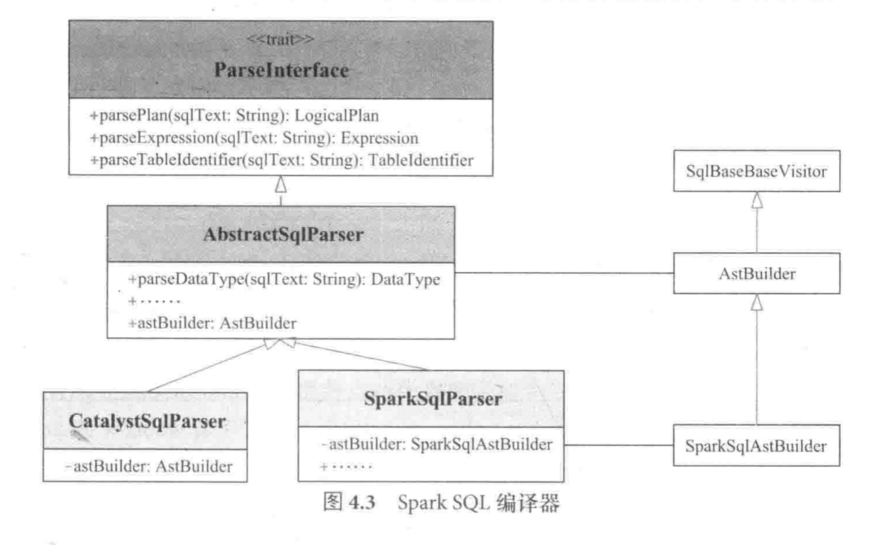
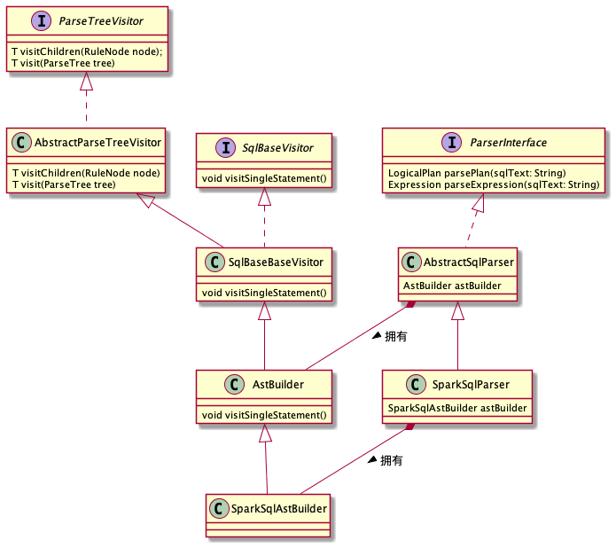
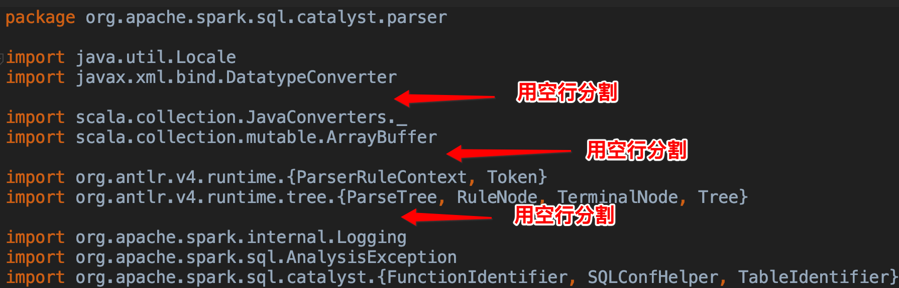

[TOC]
# 如何查看SparkSQL 生成的抽象语法树？
## 集群环境
```
mac book `macOS Catalina` version `10.15.7`
spark version `3.1.2`
java version `1.8.0_291`
scala version `2.12.10`
```

## 步骤
1. 下载剥离的Parser模块，用于查看Spark SQL语法解析SQL后生成的语法树, 并且已作为 toy-project 的项目, [下载地址](https://github.com/DonnyZone/ANTLR4-Sqlbase)
2. import 到 IDEA 中作为IDEA 项目
3. 定位到`ParserDriver`下的 `main`函数
4. 编写待运行的query string 即可查看到 语法树的组成

## 问题
output 没有展现树的层次

## 解决问题

修改 `MyVisitor` 中的`visitSingleStatement`方法, 增加自定义方法 `printRuleContextInTreeStyle`

```java
    public String visitSingleStatement(SqlBaseParser.SingleStatementContext ctx) {
        System.out.println("visitSingleStatement");
        printRuleContextInTreeStyle(ctx,1);
        return visitChildren(ctx);
    }
    
    public String visitSingleExpression(SqlBaseParser.SingleExpressionContext ctx) {
        System.out.println("visitSingleExpression");
        return visitChildren(ctx);
    }

    private void printRuleContextInTreeStyle(ParserRuleContext ctx, Integer level){
        StringBuilder sb = new StringBuilder();
        generateOutputString(sb, ctx, level);
        System.out.println(sb.toString());

        List<ParseTree> children = ctx.children;
        if( children == null || children.size() == 0) {
            return;
        }

        Iterator<ParseTree> iterator = children.iterator();
        while (iterator.hasNext()) {
            ParseTree next = iterator.next();
            if (next instanceof ParserRuleContext) {
                printRuleContextInTreeStyle((ParserRuleContext)next, level + 1);
            } else {
                StringBuilder sbInner = new StringBuilder();
                generateOutputString(sbInner, next, level+1);
                System.out.println(sbInner.toString());
            }
        }
    }

    private void generateOutputString(StringBuilder sb, ParseTree ctx, int level){
        String prefix = "|";
        sb.append(prefix);
        sb.append(level);

        for (int i = 0; i < level; i++) {
            sb.append("-");
        }
        sb.append(" ");
        sb.append(ctx.getClass().getCanonicalName()+ "  " + ctx.getText());
    }
```

## 原理
为什么仅在`visitSingleStatement`方法递归打印ctx的 children, 即可打印出抽象语法树?
### ANTRL 4
ANTRL 4.0 通过配置的 sqlBase.g4文件的规则将 sql strinng转换为一棵抽象语法树, 通过 children 保存儿子节点维持树型结构

### visitSingleStatement是将AST tree 转为 unslovedLogicalTree 的入口
#####  1. spark sql 示例代码
```scala
spark.sql("select * from student").show()
```

##### 2.SparkSession的sql 方法
```scala
  /**
   * Executes a SQL query using Spark, returning the result as a `DataFrame`.
   * This API eagerly runs DDL/DML commands, but not for SELECT queries.
   *
   * @since 2.0.0
   */
  def sql(sqlText: String): DataFrame = withActive {
    val tracker = new QueryPlanningTracker
    //生成的是 logical plan
    val plan: LogicalPlan = tracker.measurePhase(QueryPlanningTracker.PARSING) {
      sessionState.sqlParser.parsePlan(sqlText)
    }
    val frame: DataFrame = Dataset.ofRows(self, plan, tracker)
    frame
  }
  
//深入查看QueryPlanningTracker
/**
 * A simple utility for tracking runtime and associated stats in query planning.
 *
 * There are two separate concepts we track:
 *
 * 1. Phases: These are broad scope phases in query planning, as listed below, i.e. analysis,
 * optimization and physical planning (just planning).
 *
 * 2. Rules: These are the individual Catalyst rules that we track. In addition to time, we also
 * track the number of invocations and effective invocations.
 */
object QueryPlanningTracker {

  // Define a list of common phases here.
  val PARSING = "parsing"
  val ANALYSIS = "analysis"
  val OPTIMIZATION = "optimization"
  val PLANNING = "planning"
  ...
}
//发现主要目的是 用于跟踪query planning(查询计划)中的运行时和相关统计信息的简单工具。

//查看measurePhase方法
  /**
   * Measure the start and end time of a phase. Note that if this function is called multiple
   * times for the same phase, the recorded start time will be the start time of the first call,
   * and the recorded end time will be the end time of the last call.
   */
  def measurePhase[T](phase: String)(f: => T): T = {
    val startTime = System.currentTimeMillis()
    val ret = f
    val endTime = System.currentTimeMillis

    if (phasesMap.containsKey(phase)) {
      val oldSummary = phasesMap.get(phase)
      phasesMap.put(phase, new PhaseSummary(oldSummary.startTimeMs, endTime))
    } else {
      phasesMap.put(phase, new PhaseSummary(startTime, endTime))
    }
    ret//调用 sessionState.sqlParser.parsePlan(sqlText)
  }
  //发现在最后调用了传入的 f 方法
```

##### parsePlan具体被谁? 在哪被调用了?
需要解答 sessionState实例如何如何被创建? sqlParser如何被创建?

先看`sessionState`
```scala
  /**
   * State isolated across sessions, including SQL configurations, temporary tables, registered
   * functions, and everything else that accepts a [[org.apache.spark.sql.internal.SQLConf]].
   * If `parentSessionState` is not null, the `SessionState` will be a copy of the parent.
   *
   * This is internal to Spark and there is no guarantee on interface stability.
   *
   * @since 2.2.0
   */
  @Unstable
  @transient
  lazy val sessionState: SessionState = {
    parentSessionState
      .map(_.clone(this))
      .getOrElse {
        val state = SparkSession.instantiateSessionState(
          SparkSession.sessionStateClassName(sparkContext.conf),
          self,
          initialSessionOptions)
        state
      }
  }
```
发现是懒加载, 首次调用会创建, 再次即使用已经存在的实例,创建语句如下:
```
val state = SparkSession.instantiateSessionState(
          SparkSession.sessionStateClassName(sparkContext.conf),
          self,
          initialSessionOptions)
```
需要关注的为创建方法`instantiateSessionState`, 以及`SparkSession.sessionStateClassName(sparkContext.conf)` 参数

先看参数
```
  private def sessionStateClassName(conf: SparkConf): String = {
    conf.get(CATALOG_IMPLEMENTATION) match {
      case "hive" => HIVE_SESSION_STATE_BUILDER_CLASS_NAME
      case "in-memory" => classOf[SessionStateBuilder].getCanonicalName
    }
  }
```
可见通过读取 conf 中的`CATALOG_IMPLEMENTATION`参数, 匹配俩个可能 `hive` 和`in-memory`
> "hive" 实现 org.apache.spark.sql.hive.HiveSessionStateBuilder
> "in-memory" 实现 org.apache.spark.sql.internal.SessionStateBuilder

在看创建方法
```scala
  /**
   * Helper method to create an instance of `SessionState` based on `className` from conf.
   * The result is either `SessionState` or a Hive based `SessionState`.
   */
  private def instantiateSessionState(
      className: String,
      sparkSession: SparkSession,
      options: Map[String, String]): SessionState = {
    try {
      // invoke new [Hive]SessionStateBuilder(
      //   SparkSession,
      //   Option[SessionState],
      //   Map[String, String])
      val clazz = Utils.classForName(className)
      val ctor = clazz.getConstructors.head
      ctor.newInstance(sparkSession, None, options).asInstanceOf[BaseSessionStateBuilder].build()
    } catch {
      case NonFatal(e) =>
        throw new IllegalArgumentException(s"Error while instantiating '$className':", e)
    }
  }
```
**总结** 根据传入的 className, 可能创建 `HiveSessionStateBuilder` 或者`SessionStateBuilder`, 但是不管是哪一个都会调用共同基类`BaseSessionStateBuilder`的 `build()`方法

```scala
  /**
   * Build the [[SessionState]].
   */
  def build(): SessionState = {
    new SessionState(
      session.sharedState,
      conf,
      experimentalMethods,
      functionRegistry,
      udfRegistration,
      () => catalog,
      sqlParser,
      () => analyzer,
      () => optimizer,
      planner,
      () => streamingQueryManager,
      listenerManager,
      () => resourceLoader,
      createQueryExecution,
      createClone,
      columnarRules,
      queryStagePrepRules)
  }

  /**
   * Parser that extracts expressions, plans, table identifiers etc. from SQL texts.
   *
   * Note: this depends on the `conf` field.
   */
  protected lazy val sqlParser: ParserInterface = {
    extensions.buildParser(session, new SparkSqlParser())
  }
```
发现 sqlParser 的实例就是`new SparkSqlParser()`

##### parsePlan 干了什么?
SparkSqlParser没有该方法的实现，具体是现在其父类 AbstractSqlParser中
```scala
  /** Creates LogicalPlan for a given SQL string. */
  override def parsePlan(sqlText: String): LogicalPlan = parse(sqlText) { parser =>
    astBuilder.visitSingleStatement(parser.singleStatement()) match {
      case plan: LogicalPlan => plan
      case _ =>
        val position = Origin(None, None)
        throw new ParseException(Option(sqlText), "Unsupported SQL statement", position, position)
    }
  }
```

`parsePlan` 方法调用了 `parse`方法 传递了俩个参数 `sqlText` 和 回调函数

```
{ parser =>
    astBuilder.visitSingleStatement(parser.singleStatement()) match {
      case plan: LogicalPlan => plan
      case _ =>
        val position = Origin(None, None)
        throw new ParseException(Option(sqlText), "Unsupported SQL statement", position, position)
    }
```
查看回调函数发现调用了`astBuilder`的`visitSingleStatement`方法, 到此可以知道为什么在`visitSingleStatement`方法中可以作为同一的入口打印抽象语法树了.

```scala
  /** Get the builder (visitor) which converts a ParseTree into an AST. */
  protected def astBuilder: AstBuilder

  protected def parse[T](command: String)(toResult: SqlBaseParser => T): T = {
    logDebug(s"Parsing command: $command")

    val lexer = new SqlBaseLexer(new UpperCaseCharStream(CharStreams.fromString(command)))
    lexer.removeErrorListeners()
    lexer.addErrorListener(ParseErrorListener)

    val tokenStream = new CommonTokenStream(lexer)
    val parser = new SqlBaseParser(tokenStream)
    parser.addParseListener(PostProcessor)
    parser.removeErrorListeners()
    parser.addErrorListener(ParseErrorListener)
    parser.legacy_setops_precedence_enbled = conf.setOpsPrecedenceEnforced
    parser.legacy_exponent_literal_as_decimal_enabled = conf.exponentLiteralAsDecimalEnabled
    parser.SQL_standard_keyword_behavior = conf.ansiEnabled

    try {
      try {
        // first, try parsing with potentially faster SLL mode
        parser.getInterpreter.setPredictionMode(PredictionMode.SLL)
        toResult(parser)  //首次尝试通过 SLL mode 调用toResult回调函数
      }
      catch {
        case e: ParseCancellationException =>
          // if we fail, parse with LL mode
          tokenStream.seek(0) // rewind input stream
          parser.reset()

          // Try Again.
          parser.getInterpreter.setPredictionMode(PredictionMode.LL)
          toResult(parser) //再次尝试
      }
    }
    catch {
      case e: ParseException if e.command.isDefined =>
        throw e
      case e: ParseException =>
        throw e.withCommand(command)
      case e: AnalysisException =>
        val position = Origin(e.line, e.startPosition)
        throw new ParseException(Option(command), e.message, position, position)
    }
  }
```

### AstBuilder
AstBuilder 继承了 ANTLR 4生成的默认 SparkBaseBaseVisitor,用于生成 unresolvedLogicalPlan

**默认** 知晓 sql parse 是基于观察者模式的

**spark2.1版本**



**spark3.1.2版本**


### 问题

#####  toy-project 的项目中 ANTLR v4 插件和IDEA 中的最新版本不兼容
想要修改 toy-project 的项目中的`sqlBase.g4`文件, 但是 IDEA 项目中的 ANTLR v4 插件和代码中的插件版本不兼容, 我的解决办法是,降低 IDEA 中ANTLR v4 插件版本
**步骤**
1. 下载匹配的版本 [地址](https://plugins.jetbrains.com/plugin/7358-antlr-v4/versions) , 版本v1.8.1
2. 下载好插件的安装包之后, 参考这个网址的步骤 [安装](https://riptutorial.com/intellij-idea/example/26027/to-install-a-plugin-from-the-disk)

```
1. Go to File --> Settings (e.g. Ctrl+Alt+S ).

2. In the left-hand pane, select Plugins.

3. On the Plugins window, click "Install plugin from disk button".

4. Select the desired plugin from your local machine. 

5. Click Apply button of the Settings/Preferences dialog.
```

#####  如何在 spark_3.1.2版本中打印AST
在``中 添加如下代码
```scala
  // scalastyle:off println
  override def visitSingleStatement(ctx: SingleStatementContext): LogicalPlan = withOrigin(ctx) {
    printRuleContextInTreeStyle(ctx, 1)
    visit(ctx.statement).asInstanceOf[LogicalPlan]
  }

  private def printRuleContextInTreeStyle(ctx: ParserRuleContext, level: Int): Unit = {
    val prefix: String = level + "|"
    val curLevelStr: String = "-" * level
    val childLevelStr: String = "-" * (level + 1)
    def p(treeNode: ParseTree, level: String) = {
      val str = s"${prefix}${level}"
      val str2 = s"${treeNode.getClass.getCanonicalName}"
      val str3 = s"${treeNode.getText}"
      println(str + "  " + str2 + "  " + str3)
    }
    p(ctx, curLevelStr)
    val children = ctx.children.asScala
    if( children == null || children.isEmpty) {
      return
    }
    children.foreach { treeNode: Tree =>
      treeNode match {
        case context: ParserRuleContext => printRuleContextInTreeStyle(context, level + 1)
        case node: ParseTree => p(node, childLevelStr)
        case _ =>
      }
    }
  }
  // scalastyle:on println
```

//请确保引入头文件不同的库的引入有一行空行的分隔
```scala
package org.apache.spark.sql.catalyst.parser

import java.util.Locale
import javax.xml.bind.DatatypeConverter

import scala.collection.JavaConverters._
import scala.collection.mutable.ArrayBuffer

import org.antlr.v4.runtime.{ParserRuleContext, Token}
import org.antlr.v4.runtime.tree.{ParseTree, RuleNode, TerminalNode, Tree}

import org.apache.spark.internal.Logging
import org.apache.spark.sql.AnalysisException
import org.apache.spark.sql.catalyst.{FunctionIdentifier, SQLConfHelper, TableIdentifier}
import org.apache.spark.sql.catalyst.analysis._
import org.apache.spark.sql.catalyst.catalog.{BucketSpec, CatalogStorageFormat, FunctionResource, FunctionResourceType}
import org.apache.spark.sql.catalyst.expressions._
import org.apache.spark.sql.catalyst.expressions.aggregate.{First, Last}
import org.apache.spark.sql.catalyst.parser.SqlBaseParser._
import org.apache.spark.sql.catalyst.plans._
import org.apache.spark.sql.catalyst.plans.logical._
import org.apache.spark.sql.catalyst.util.{CharVarcharUtils, IntervalUtils}
import org.apache.spark.sql.catalyst.util.DateTimeUtils.{getZoneId, stringToDate, stringToTimestamp}
import org.apache.spark.sql.catalyst.util.IntervalUtils.IntervalUnit
import org.apache.spark.sql.connector.catalog.{SupportsNamespaces, TableCatalog}
import org.apache.spark.sql.connector.catalog.TableChange.ColumnPosition
import org.apache.spark.sql.connector.expressions.{ApplyTransform, BucketTransform, DaysTransform, Expression => V2Expression, FieldReference, HoursTransform, IdentityTransform, LiteralValue, MonthsTransform, Transform, YearsTransform}
import org.apache.spark.sql.internal.SQLConf
import org.apache.spark.sql.types._
import org.apache.spark.unsafe.types.{CalendarInterval, UTF8String}
import org.apache.spark.util.random.RandomSampler
```


**步骤**
```
0. 开启科学上网
2. 在终端中先使用 `./build/sbt package -DskipTests -Phive -Phive-thriftserver` 命令 build 下项目 
3. 将 printRuleContextInTreeStyle 方法添加并在 visitSingleStatement方法中调用
4. 在终端中先使用 `./build/sbt package -DskipTests -Phive -Phive-thriftserver` 命令再次 build 下项目 
5.  在终端中先使用 `./bin/spark-sql -S`命令
6.  使用 `use default;` 命令测试
```
//console 输出
```
spark-sql> USE DEFAULT;
1|-  org.apache.spark.sql.catalyst.parser.SqlBaseParser.SingleStatementContext  USEDEFAULT<EOF>
2|--  org.apache.spark.sql.catalyst.parser.SqlBaseParser.UseContext  USEDEFAULT
2|--  org.antlr.v4.runtime.tree.TerminalNodeImpl  USE
3|---  org.apache.spark.sql.catalyst.parser.SqlBaseParser.MultipartIdentifierContext  DEFAULT
4|----  org.apache.spark.sql.catalyst.parser.SqlBaseParser.ErrorCapturingIdentifierContext  DEFAULT
5|-----  org.apache.spark.sql.catalyst.parser.SqlBaseParser.IdentifierContext  DEFAULT
6|------  org.apache.spark.sql.catalyst.parser.SqlBaseParser.UnquotedIdentifierContext  DEFAULT
6|------  org.antlr.v4.runtime.tree.TerminalNodeImpl  DEFAULT
5|-----  org.apache.spark.sql.catalyst.parser.SqlBaseParser.RealIdentContext
1|-  org.antlr.v4.runtime.tree.TerminalNodeImpl  <EOF>
21/11/17 02:32:52 WARN ObjectStore: Failed to get database global_temp, returning NoSuchObjectException
```

被 `// scalastyle:off println`和 `// scalastyle:on println` 括住的代码 可以使用 println方法打印到控制台
```
  // scalastyle:off println
  // scalastyle:on println
```

## 参考
参考《Spark SQL内核剖析》一书生成 unsolvedLogicalTree 的过程, 并且参考 [如何查看SparkSQL 生成的抽象语法树？](https://www.cnblogs.com/johnny666888/p/12345142.html) 