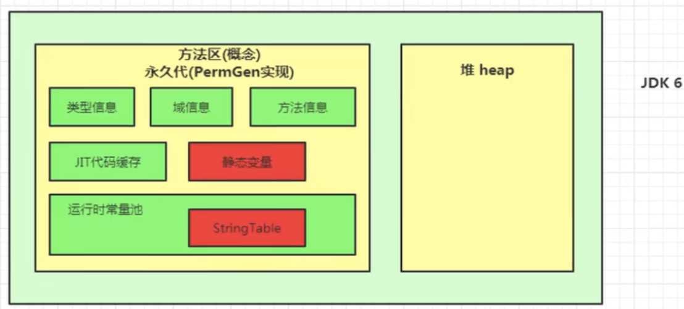

[TOC]
# 内存分布
## iOS 内存分布
```object-c
 栈区(stack)
 堆区(heap)
 全局/静态区(bss)
 文字/常量区(data)
 代码区(code)
```


### 栈
栈又称堆栈, 是用户存放程序临时创建的局部变量,也就是说我们函数括弧“{}” 中定义的变量(但不包括static声明的变量,static意味着在数据段中存放变量)

指针都存在栈区，用于指向分配在堆区的内存的地址。
```object-c
- (void)test{
  int a = 10;
  // a指针地址是在栈区的 0x7xxxx, a数值的地址存放在常量区
  NSLog(@"a=%d,a地址：%p",a,&a); 

  //obj 指针地址 fun 放在栈区, obj 对象地址存放在堆区 
  NSObject *obj = [NSObject new]; 
  NSLog(@"obj对象-%@，obj指针地址：%p",obj,&obj); 
}

//output
a=10, a地址：0x7ffee2acc1ec
obj对象-<NSObject: 0x600000fbc270>，obj指针地址：0x7ffee2acc1e0
//对象的内存地址和对象指针的内存地址不是同一个
//而且obj的指针地址0x7xxxx在栈区，对象是在堆区0x6xxxx
//一般情况0x7xxxx 就是栈区，0x6xxxx就是堆区
```

### 堆
* 堆是用于存放进程运行中被动态分配的内存段,它的大小并不固定,可动态扩张或缩减。当进程调用malloc等函数分配内存时,新分配的内存就被动态添加到堆上(堆被扩张); 当利用free等函数释放内存时,被释放的内存从堆中被剔除(堆被缩减)
* 堆向高地址扩展的数据结构，是不连续的内存区域。程序员负责在何时释放内存（如用free或delete），在iOS的ARC程序中，系统自动管理计数器，计数器为0的时候，在当次的runloop结束后，释放掉内存。

**问题**
对于堆来讲,频繁的new/delete势必会造成内存空间的不连续性，从而造成大量的碎片 ,使程序效率降低。

### 全局区/静态区(bss)
* bss段通常是指用来存放程序中`未初始化的全局变量和静态变量`的一块内存区域。
* 通常来说如果不初始化全局变量和静态变量，编译器也会对它们进行一个`隐式初始化`（直接赋值就是显示初始化），赋给它们一个缺省值，是我们这里所说的未初始化。
* bss段在程序执行之前会清0，所以未初始化的全局变量（静态变量）已经是`0`了。所以这种情况还是存放在BSS段，一旦初始化就会从BSS段中回收掉，转存到data段(数据段)中。
* bss区-Block Started by Symbol（未初始化数据段）：并不给该段的数据分配空间，仅仅是记录了数据所需空间的大小。

### 常量区/文字(data)
* 数据段分为`只读`数据段(常量区)和`读写`数据段
* 通常是指用来存放程序中`已经初始化`的全局变量和静态变量的一块内存区域。数据段属于静态内存分配,可以分为只读数据段和读写数据段。`字符串常量等,是放在只读数据段中`，结束程序时才会被收回。

### 代码区
通常是指用来存放程序执行代码的一块内存区域。这部分区域的大小在程序运行前就已经确定,并且内存区域通常属于只读, 某些架构也允许代码段为可写,即允许修改程序。在代码段中,也有可能包含一些只读的常数变量,例如字符串常量等,这些常量放在只读数据段(data segment)中，也有叫做常量区的说法。

## JAVA

### 栈


栈桢的结构


栈中方法的返回方式


### 寄存区


### 本地方法栈

本地方法栈用于管理本地方法的调用, 当某个线程调用一个本地方法时, 它就进入了一个全新的并且不在受虚拟机限制的世界. 它和虚拟机拥有同样的权限

### 堆

详细看一下堆的内存划分


### 方法区
#### 方法区介绍

#### 方法区历史演变
回顾一下历史, jdk8之前代码存放`永久代`(堆中) , jdk8之后代码存放`元空间`(本地内存中), 现在看来, 当年使用永久代并不是很好的注意, 导致 jvm 更容易 OOM. 

* 元空间使用`本地`内存空间
* 永久代使用 JVM `堆`内存空间




**为什么要将 String table 的位置从方法区, 调换到堆区**
jdk7中将 StringTable放到了堆空间中, 因为永久代的回收效率很低, 在 full gc 的时候才会触发. 而 full  gc 是老年代的空间不足, 永久代不足时才会触发, 这意味着 StringTable 回收效率不高, 而我们开发中会有大量的字符串被创建, 回收效率低, 导致永久代内存不足. 
而将 StringTable放在堆中可以及时回收内存.

#### 方法区大小配置


#### 运行时常量池
1. 字节码文件中包含常量池
2. 方法区内部也包含了运行时常量池
**关系**
1. 运行时常量池是方法区的一部分
2. 常量池表是 class 文件的一部分, 用于存放编译期生成的各种字面量和符号引用, 这部分的内容将在`类加载`后存放到`方法区的运行时常量池中`, 方法区中运行时常量池会将`符号引用`替换为`直接引用`. 
**不同**
运行时常量池, 相对于 class 文件常量池的另一个重要特征就是: 动态性

字节码文件中包含的内容


**总结**
常量池可以看做时候`一张表`, 虚拟机指令根据这张表找到要执行的类名, 方法名, 参数类型, 字面量等类型. 

### 栈, 堆和方法区的交互


## 补充: 如何调试 OOM-思路


## 参考链接

[ios 内存分配](https://www.jianshu.com/p/231d20940015)


