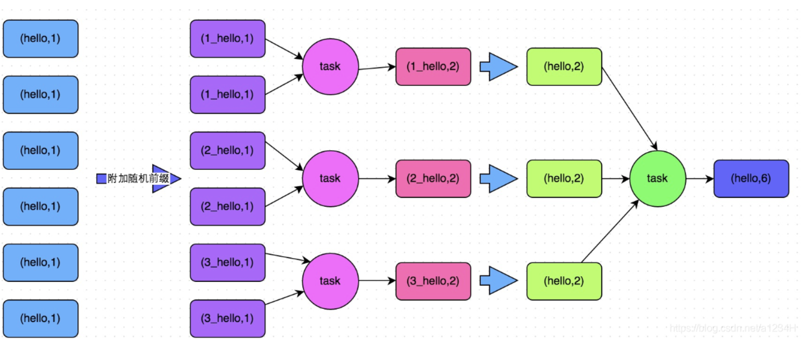
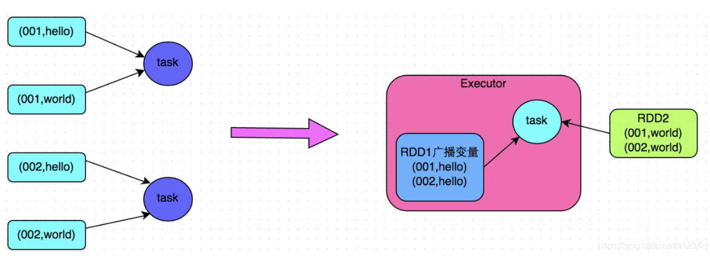
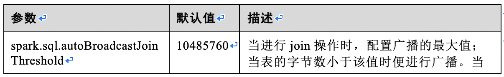
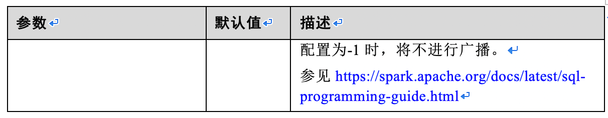
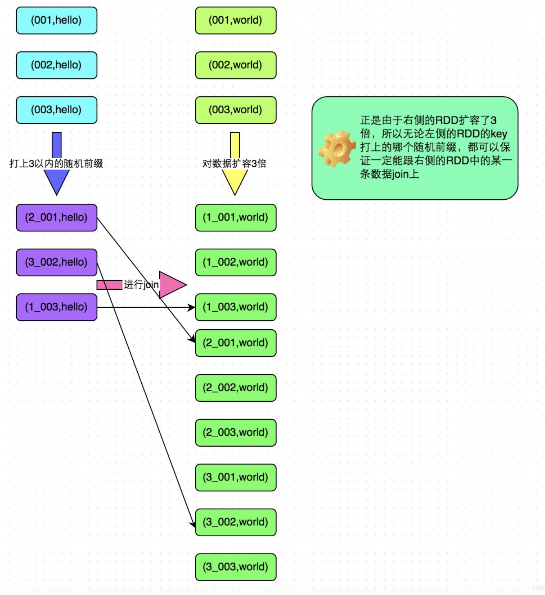
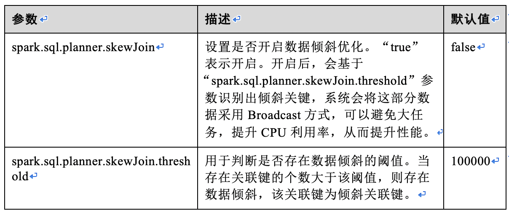

# spark数据倾斜问题

## 什么是数据倾斜

## 如何知道发生了数据倾斜
**任务的运行速度不可接受的慢, 更严重的会导致 OOM**

* 绝大多数task执行得都非常快，但个别task执行极慢。比如，总共有1000个task，997个task都在1分钟之内执行完了，但是剩余两三个task却要一两个小时。这种情况很常见。
* 原本能够正常执行的Spark作业，某天突然报出OOM（内存溢出）异常，观察异常栈，是我们写的业务代码造成的。这种情况比较少见。

## 如何定位数据倾斜发生在代码的(sql 的)哪个部分
stage -> shuffle -> 会导致 shuffle 的算子 -> 代码

## 定位倾斜发生的 key
countByKey() 统计 key 的分布, 可以通过 sample 来简化任务

## 如何解决数据倾斜问题
### 1.使用Hive ETL预处理数据
**方案适用场景：**导致数据倾斜的是Hive表。如果该Hive表中的数据本身很不均匀（比如某个key对应了100万数据，其他key才对应了10条数据），而且业务场景需要频繁使用Spark对Hive表执行某个分析操作，那么比较适合使用这种技术方案。

**方案实现思路：**此时可以评估一下，是否可以通过Hive来进行数据预处理（即通过Hive ETL预先对数据按照key进行聚合，或者是预先和其他表进行join），然后在Spark作业中针对的数据源就不是原来的Hive表了，而是预处理后的Hive表。此时由于数据已经预先进行过聚合或join操作了，那么在Spark作业中也就不需要使用原先的shuffle类算子执行这类操作了。

**方案优点：**实现起来简单便捷，效果还非常好，完全规避掉了数据倾斜，Spark作业的性能会大幅度提升。
**方案缺点：**治标不治本，Hive ETL中还是会发生数据倾斜。

### 2.过滤少数导致倾斜的key
**方案适用场景：**如果发现导致倾斜的key就少数几个，**而且对计算本身的影响并不大的话**，那么很适合使用这种方案。比如99%的key就对应10条数据，但是只有一个key对应了100万数据，从而导致了数据倾斜。

**方案实现思路：**如果我们判断那少数几个数据量特别多的key，对作业的执行和计算结果不是特别重要的话，那么干脆就直接过滤掉那少数几个key。比如，在Spark SQL中可以使用where子句过滤掉这些key或者在Spark Core中对RDD执行filter算子过滤掉这些key。如果需要每次作业执行时，动态判定哪些key的数据量最多然后再进行过滤，那么可以使用sample算子对RDD进行采样，然后计算出每个key的数量，取数据量最多的key过滤掉即可。

**方案优点：**实现简单，而且效果也很好，可以完全规避掉数据倾斜。
**方案缺点：**适用场景不多，大多数情况下，导致倾斜的key还是很多的，并不是只有少数几个。

### 3.提高shuffle操作的并行度
**方案适用场景：**如果我们必须要对数据倾斜迎难而上，那么建议优先使用这种方案，因为这是处理数据倾斜最简单的一种方案。

**方案优点：**实现起来比较简单，可以有效缓解和减轻数据倾斜的影响。
**方案缺点：**只是缓解了数据倾斜而已，没有彻底根除问题，根据实践经验来看，其效果有限。

**方案实践经验：**该方案通常无法彻底解决数据倾斜，因为如果出现一些极端情况，比如某个key对应的数据量有100万，那么无论你的task数量增加到多少，这个对应着100万数据的key肯定还是会分配到一个task中去处理，因此注定还是会发生数据倾斜的。所以这种方案只能说是在发现数据倾斜时尝试使用的第一种手段，尝试去用嘴简单的方法缓解数据倾斜而已，**或者是和其他方案结合起来使用**。

### 4.两阶段聚合（局部聚合+全局聚合）--- 推荐在需要聚合的算子中使用
**方案适用场景：**对RDD执行reduceByKey等聚合类shuffle算子或者在Spark SQL中使用group by语句进行分组聚合时，比较适用这种方案。

**方案实现思路：**这个方案的核心实现思路就是进行两阶段聚合。第一次是局部聚合，先给每个key都打上一个随机数，比如10以内的随机数，此时原先一样的key就变成不一样的了，比如(hello, 1) (hello, 1) (hello, 1) (hello, 1)，就会变成(1_hello, 1) (1_hello, 1) (2_hello, 1) (2_hello, 1)。接着对打上随机数后的数据，执行reduceByKey等聚合操作，进行局部聚合，那么局部聚合结果，就会变成了(1_hello, 2) (2_hello, 2)。然后将各个key的前缀给去掉，就会变成(hello,2)(hello,2)，再次进行全局聚合操作，就可以得到最终结果了，比如(hello, 4)。

**方案实现原理：**将原本相同的key通过附加随机前缀的方式，变成多个不同的key，就可以让原本被一个task处理的数据分散到多个task上去做局部聚合，进而解决单个task处理数据量过多的问题。接着去除掉随机前缀，再次进行全局聚合，就可以得到最终的结果。具体原理见下图。

**方案优点：**对于聚合类的shuffle操作导致的数据倾斜，效果是非常不错的。通常都可以解决掉数据倾斜，或者至少是大幅度缓解数据倾斜，将Spark作业的性能提升数倍以上。
**方案缺点：**仅仅适用于聚合类的shuffle操作，适用范围相对较窄。如果是join类的shuffle操作，还得用其他的解决方案。

### 5.将reduce join转为map join
**方案适用场景：**在对RDD使用join类操作，或者是在Spark SQL中使用join语句时，而且join操作中的一个RDD或表的数据量比较小（比如几百M或者一两G），比较适用此方案。

**方案优点：**对join操作导致的数据倾斜，效果非常好，因为根本就不会发生shuffle，也就根本不会发生数据倾斜。
**方案缺点：**适用场景较少，因为这个方案只适用于一个大表和一个小表的情况。毕竟我们需要将小表进行广播，此时会比较消耗内存资源，driver和每个Executor内存中都会驻留一份小RDD的全量数据。如果我们广播出去的RDD数据比较大，比如10G以上，那么就可能发生内存溢出了。因此并不适合两个都是大表的情况。

**配置参数: **

### 6.采样倾斜key并分拆join操作
**方案适用场景：**两个RDD/Hive表进行join的时候，如果数据量都比较大，无法采用“解决方案五”，那么此时可以看一下两个RDD/Hive表中的key分布情况。如果出现数据倾斜，**是因为其中某一个RDD/Hive表中的少数几个key的数据量过大**，而另一个RDD/Hive表中的所有key都**分布比较均匀**，那么采用这个解决方案是比较合适的。

**方案实现思路：**

* 对包含少数几个数据量过大的key的那个RDD，通过sample算子采样出一份样本来，然后统计一下每个key的数量，计算出来数据量最大的是哪几个key。
* 然后将这几个key对应的数据从原来的RDD中拆分出来，形成一个单独的RDD，并给每个key都打上n以内的随机数作为前缀，而不会导致倾斜的大部分key形成另外一个RDD。
* 接着将需要join的另一个RDD，也过滤出来那几个倾斜key对应的数据并形成一个单独的RDD，将每条数据膨胀成n条数据，这n条数据都按顺序附加一个0~n的前缀，不会导致倾斜的大部分key也形成另外一个RDD。
* 再将附加了随机前缀的独立RDD与另一个膨胀n倍的独立RDD进行join，此时就可以将原先相同的key打散成n份，分散到多个task中去进行join了。
* 而另外两个普通的RDD就照常join即可。
* 最后将两次join的结果使用union算子合并起来即可，就是最终的join结果。

**方案实现原理：**对于join导致的数据倾斜，如果只是某几个key导致了倾斜，可以将少数几个key分拆成独立RDD，并附加随机前缀打散成n份去进行join，此时这几个key对应的数据就不会集中在少数几个task上，而是分散到多个task进行join了。具体原理见下图。

**方案优点：**对于join导致的数据倾斜，如果只是某几个key导致了倾斜，采用该方式可以用最有效的方式打散key进行join。而且只需要针对少数倾斜key对应的数据进行扩容n倍，不需要对全量数据进行扩容。避免了占用过多内存。
**方案缺点：**如果导致倾斜的key特别多的话，比如成千上万个key都导致数据倾斜，那么这种方式也不适合。

### 7.使用随机前缀和扩容RDD进行join
**方案适用场景：**如果在进行join操作时，RDD中有大量的key导致数据倾斜，那么进行分拆key也没什么意义，此时就只能使用最后一种方案来解决问题了。

**方案实现思路：**

* 该方案的实现思路基本和“解决方案六”类似，首先查看RDD/Hive表中的数据分布情况，找到那个造成数据倾斜的RDD/Hive表，比如有多个key都对应了超过1万条数据。
* 然后将该RDD的每条数据都打上一个n以内的随机前缀。
* 同时对另外一个正常的RDD进行扩容，将每条数据都扩容成n条数据，扩容出来的每条数据都依次打上一个0~n的前缀。
* 最后将两个处理后的RDD进行join即可。

**方案优点：**对join类型的数据倾斜基本都可以处理，而且效果也相对比较显著，性能提升效果非常不错。
**方案缺点：**该方案更多的是缓解数据倾斜，而不是彻底避免数据倾斜。而且需要对整个RDD进行扩容，对内存资源要求很高。

### 8. spark 内部的优化- 配置skewJoin

**方案适用场景：**在Spark SQL多表Join的场景下，会存在关联键严重倾斜的情况，导致Hash**分桶**后，部分桶中的数据远远高于其它分桶。最终导致部分Task过重，跑得很慢；其它Task过轻，跑得很快。一方面，数据量大Task运行慢，使得计算性能低；另一方面，数据量少的Task在运行完成后，导致很多CPU空闲，造成CPU资源浪费。

**方案实现思路：**通过如下配置项可将部分数据采用Broadcast方式分发，以便均衡Task，提高CPU资源的利用率，从而提高性能。未产生倾斜的数据，将采用原有方式进行分桶并运行。

**使用约束：**
1.	两表中倾斜的关联键不同。（例如：A join B on A.name = B.name，如果A中name = "zhangsan"倾斜，那么B中name = "zhangsan"不能倾斜，其他的如name = "lisi"可以倾斜。）
2.	只支持两表间的Join。
3.	TS（TableScan）到Join之间的操作只支持TS（TableScan）、FIL（Filter）、SEL（Select）。

**配置参数**

### 9.多种方案组合使用

[spark 定位 解决小文件问题](https://blog.csdn.net/a1234H/article/details/85073320)

