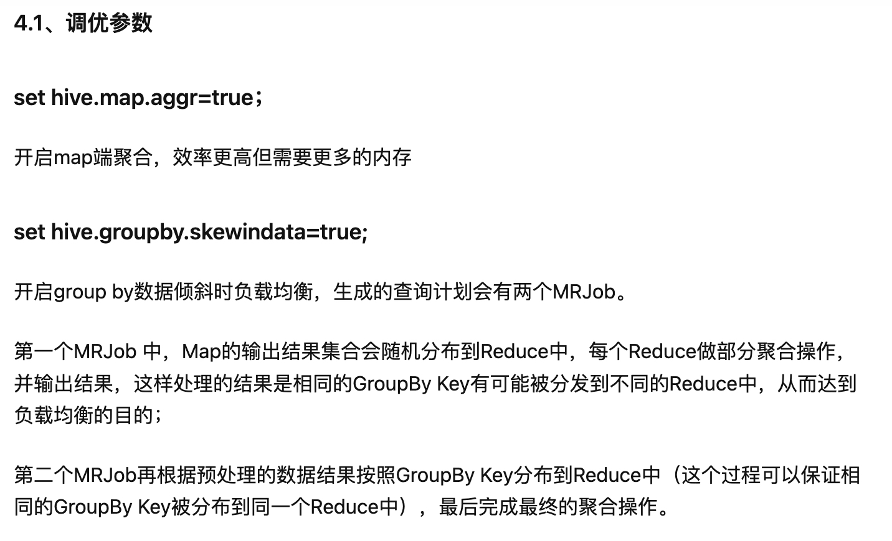

# hive 数据倾斜问题

## 为什么数据会倾斜
原因同 spark 中数据倾斜的原因相同, 在下面补充一条join 造成的数据倾斜

场景：两表关联键的数据类型不一致，一个是int，另外一个是string时，默认的Hash操作会按int型的id来进行分配，这样会导致所有string类型id的记录都分配到一个Reducer中。

```sql
-- 解决方法：把数字类型转换成字符串类型
select * from dmf_dev.dmf_dev__mu_d01 t1

left join dmf_dev.dmf_dev__mu_d02 t2

on cast(t1.id as string) = t2.id
```

## 如何解决数据倾斜


group by/count(distinct XX) 参数调优


[参考文档](https://www.cnblogs.com/itlz/p/15105444.html)
[hive 数据倾斜](https://zhuanlan.zhihu.com/p/376286414#:~:text=%E6%95%B0%E6%8D%AE%E5%80%BE%E6%96%9C%E7%9A%84%E6%A0%B9%E6%9C%AC%E5%8E%9F,%E8%AE%A1%E7%AE%97%E8%83%BD%E5%8A%9B%E7%9A%84%E7%BB%93%E6%9E%9C%EF%BC%9B)

