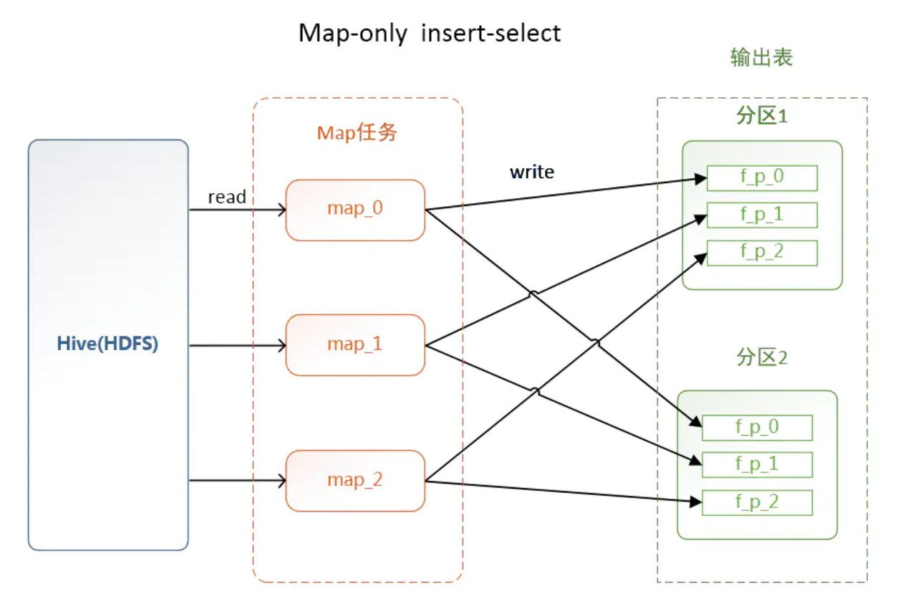
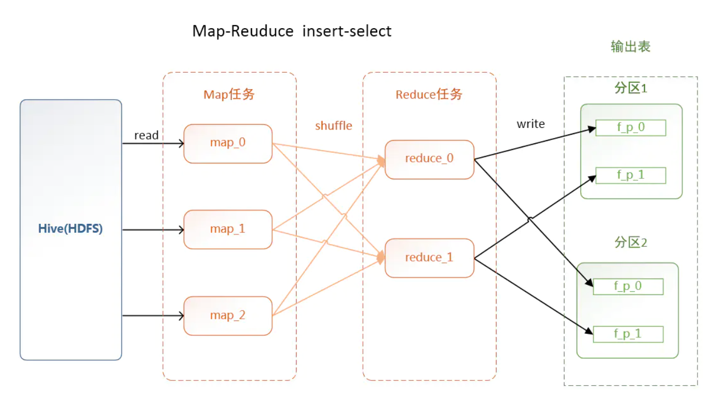

# spark 小文件问题

## 什么是小文件
本文所讲的是指存储于HDFS中小文件，即指文件的大小远小于HDFS上块（dfs.block.size）大小的文件。

## 小文件问题的影响
**背景**
一方面，大量的小文件会给Hadoop集群的扩展性和性能带来严重的影响。NameNode在内存中维护整个文件系统的元数据镜像，用户HDFS的管理；

**影响**
1. 其中每个HDFS文件元信息（位置，大小，分块等）对象约占150字节，如果小文件过多，会占用大量内存，直接影响NameNode的性能。
2. HDFS读写小文件也会更加耗时，因为每次都需要从NameNode获取元信息，并与对应的DataNode建立连接。
3. 如果NameNode在宕机中恢复，也需要更多的时间从元数据文件中加载。

另一方面，也会给Spark SQL等查询引擎造成查询性能的损耗，大量的数据分片信息以及对应产生的Task元信息也会给Spark Driver的内存造成压力，带来单点问题。此外，入库操作最后的commit job操作，在Spark Driver端单点做，很容易出现单点的性能问题。

## 情况1
**数据源本省就包含大量小文件**

## 情况2
**动态分区插入数据**
```sql
use tpcds_1t_parquet;

INSERT overwrite table store_sales partition 
       ( 
              ss_sold_date_sk 
       ) 
SELECT ss_sold_time_sk, 
       ss_item_sk, 
       ss_customer_sk, 
       ss_cdemo_sk, 
       ss_hdemo_sk, 
       ss_addr_sk, 
       ss_store_sk, 
       ss_promo_sk, 
       ss_ticket_number, 
       ss_quantity, 
       ss_wholesale_cost, 
       ss_list_price, 
       ss_sales_price, 
       ss_ext_discount_amt, 
       ss_ext_sales_price, 
       ss_ext_wholesale_cost, 
       ss_ext_list_price, 
       ss_ext_tax, 
       ss_coupon_amt, 
       ss_net_paid, 
       ss_net_paid_inc_tax, 
       ss_net_profit, 
       ss_sold_date_sk 
FROM   tpcds_1t_ext.et_store_sales;
```
没有Shuffle的情况下，输入端有多少个逻辑分片，对应的HadoopRDD就会产生多少个HadoopPartition，每个Partition对应于Spark作业的Task（个数为M），分区数为N。最好的情况就是（M=N） && （M中的数据也是根据N来预先打散的），那就刚好写N个文件；最差的情况下，每个Task中都有各个分区的记录，那文件数最终文件数将达到M * N个。这种情况下是极易产生小文件的。



假设store_sales的原生文件包含1616逻辑分片，对应生成1616 个Spark Task，插入动态分区表之后生成1824个数据分区(**ss_sold_date_sk有1824个不同的值**)加一个NULL值的分区，每个分区下都有可能生成1616个文件，这种情况下，最终的文件数量极有可能达到2949200。1T的测试集store_sales也就大概300g，这种情况每个文件可能就零点几M。

## 解决办法
### 1.数据源本省就包含大量小文件-->合并小文件-combine
**使用场景 **当SQL逻辑中包含Shuffle操作时。

**原因说明: **Spark SQL的表中，经常会存在很多小文件（大小远小于HDFS块大小），每个小文件默认对应Spark中的一个Partition，也就是一个Task。在很多小文件场景下，Spark会起很多Task。当SQL逻辑中存在Shuffle操作时，会大大增加hash分桶数，严重影响性能。

**配置参数: **在小文件场景下，您可以通过如下配置手动指定每个Task的数据量（Split Size），确保不会产生过多的Task，提高性能。


### 2.动态分区插入数据-->按照分区字段 shuffle
根据分区字段进行shuffle，在上面的sql中加上distribute by ss_sold_date_sk。把同一分区的记录都哈希到同一个分区中去，由一个Spark的Task进行写入，这样的话只会产生N个文件，在我们的case中store_sales，在1825个分区下各种生成了一个数据文件。
```sql
......
FROM   tpcds_1t_ext.et_store_sales 
distribute by ss_sold_date_sk;
```



**引发新的问题** 但是这种情况下也容易出现但**数据倾斜**的问题，比如双11的销售数据就很容易在这种情况下发生倾斜。

**数据倾斜问题的解决办法**
在我们知道那个分区键倾斜的情况下，我们也可以将入库的SQL拆成几个部分，比如我们`store_sales`是因为null值倾斜，我们就可以通过`where ss_sold_date_sk is not null` 和 `where ss_sold_date_sk is null` 将原始数据分成两个部分。
```sql
FROM   tpcds_1t_ext.et_store_sales 
where ss_sold_date_sk is not null
distribute by ss_sold_date_sk;
```

对于倾斜部分的数据，我们可以开启Spark SQL的自适应功能，`spark.sql.adaptive.enabled=true`来动态调整每个相当于Spark的reduce端task处理的数据量，这样我们**就不需要人为的感知随机值的规模了**，我们可以直接
```sql
FROM   tpcds_1t_ext.et_store_sales 
where ss_sold_date_sk is null
distribute by distribute by rand() ;
```
然后Spark在Shuffle 阶段会自动的帮我们将数据尽量的合并成`spark.sql.adaptive.shuffle.targetPostShuffleInputSize`（默认64m）的大小，以减少输出端写文件线程的总量，最后减少个数。

对于`spark.sql.adaptive.shuffle.targetPostShuffleInputSize`参数而言，我们也可以设置成为`dfs.block.size`的大小，这样可以做到和块对齐，文件大小可以设置的最为合理。

[如何避免Spark SQL做数据导入时产生大量小文件](https://bbs.huaweicloud.com/blogs/266513)
