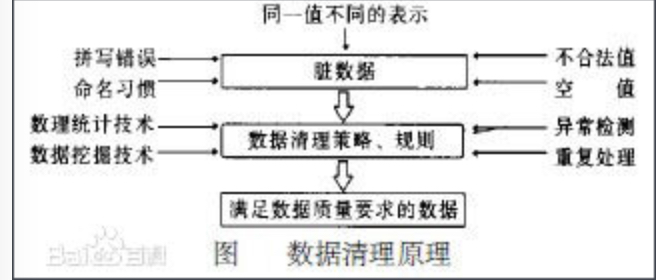

[TOC]
# ETL

## 什么是数据清洗
**数据清洗**  一般来说，数据清理是将数据库精简以除去重复记录，并使剩余部分转换成`标准可接收格式`的过程。数据清理标准模型是将数据输入到数据清理处理器，通过一系列步骤“ 清理”数据，然后以期望的格式输出清理过的数据。数据清理从数据的`准确性、完整性、一致性、惟一性、有效性`几个方面来处理数据的`丢失值、越界值、不一致代码、重复数据`等问题。

## 为什么要数据清洗
事先花费些时间清洗和准备好数据科学工作区、工具和原始数据，都是值得的。“错进，错出。”这句源于上20世纪60年代的计算机编程箴言，对如今的数据科学来说亦为真理。

简单的来说，进行数据清洗就是使数据变得完整和精准，从而使后续对这些数据进行分析的结果更为准确。

## 数据清洗原理
预定义的清理规则将脏数据转化为满足数据质量要求的数据。

## 数据清洗的方法
### 无效值,缺失值和重复数据的处理
#### 缺失值
**定义**
这一类数据主要是一些应该有的信息缺失

**例子**
如供应商的名称、分公司的名称、客户的区域信息缺失、业务系统中主表与明细表不能匹配等。

**如何处理**
对于这一类数据过滤出来，按缺失的内容分别写入不同Excel文件向客户提交，要求在规定的时间内补全。补全后才写入数据仓库。

**sql 上如何处理**
##### 无效值和缺失值的处理
由于调查、编码和录入误差，数据中可能存在一些无效值和缺失值，需要给予适当的处理。

**估算**
最简单的办法就是用某个变量的样本均值、中位数或众数代替无效值和缺失值。这种办法简单，但没有充分考虑数据中已有的信息，误差可能较大。另一种办法就是根据调查对象对其他问题的答案，通过变量之间的相关分析或逻辑推论进行估计。例如，某一产品的拥有情况可能与家庭收入有关，可以根据调查对象的家庭收入推算拥有这一产品的可能性。

**整例删除**
剔除含有缺失值的样本。由于很多问卷都可能存在缺失值，这种做法的结果可能导致有效样本量大大减少，无法充分利用已经收集到的数据。因此，只适合关键变量缺失，或者含有无效值或缺失值的样本比重很小的情况

**变量删除**
如果某一变量的无效值和缺失值很多，而且该变量对于所研究的问题不是特别重要，则可以考虑将该变量删除。这种做法减少了供分析用的变量数目，但没有改变样本量。

**成对删除**
用一个特殊码(通常是9、99、999等)代表无效值和缺失值，同时保留数据集中的全部变量和样本。但是，在具体计算时只采用有完整答案的样本，因而不同的分析因涉及的变量不同，其有效样本量也会有所不同。这是一种保守的处理方法，最大限度地保留了数据集中的可用信息。

#### 无效值
**定义**
这一类错误产生的原因是业务系统不够健全，在接收输入后没有进行判断直接写入后台数据库造成的

**例子**
比如数值数据输成全角数字字符、字符串数据后面有一个回车操作、日期格式不正确、日期越界等。这一类数据也要分类，对于类似于全角字符、数据前后有不可见字符的问题

**如何处理**
只能通过写SQL语句的方式找出来，然后要求客户在业务系统修正之后抽取。日期格式不正确的或者是日期越界的这一类错误会导致ETL运行失败，这一类错误需要去业务系统数据库用SQL的方式挑出来，交给业务主管部门要求限期修正，修正之后再抽取。

**sql 上如何处理**
[无效值和缺失值的处理](#无效值和缺失值的处理)

#### 重复数据
数据库中属性值相同的记录被认为是重复记录，通过判断记录间的属性值是否相等来检测记录是否相等 (对于这一类数据——特别是维表中会出现这种情况)

**业务上如何处理**
将重复数据记录的所有字段导出来，让客户确认并整理。

**sql 上如何处理**
客户确认之后, 相等的记录合并为一条记录（即合并/清除)。合并/清除是消重的基本方法。

### 不一致性检查
**定义**
一致性检查(consistency check)是根据每个变量的合理取值范围和相互关系，检查数据是否合乎要求，发现超出正常范围、逻辑上不合理或者相互矛盾的数据。

**例子**
例如，许多调查对象说自己开车上班，又报告没有汽车；或者调查对象报告自己是某品牌的重度购买者和使用者，但同时又在熟悉程度量表上给了很低的分值。发现不一致时，要列出问卷序号、记录序号、变量名称、错误类别等，便于进一步核对和纠正

**业务上如何处理**
将不一致数据记录的所有字段导出来，让客户确认并整理。

### 标准化
为了使记录实例匹配和合并变得更方便，应该把属性值转换成一个一致和统一的格式。

## 数据清洗的评价标准
1. 数据的可信性
可信性包括精确性、完整性、一致性、有效性、唯一性等指标。
(1)精确性：描述数据是否与其对应的客观实体的特征相一致。
(2)完整性：描述数据是否存在缺失记录或缺失字段。
(3)一致性：描述同一实体的同一属性的值在不同的系统是否一致。
(4)有效性：描述数据是否满足用户定义的条件或在一定的域值范围内。
(5)唯一性：描述数据是否存在重复记录。

2. 数据清洗的代价
数据清洗的代价即成本效益，在进行数据清洗之前考虑成本效益这个因素是很必要的。因为数据清洗是一项十分繁重的工作，需要投入大量的时间、人力和物力。在进行数据清洗之前要考虑其物质和时间开销的大小，是否会超过组织的承受能力。通常情况下大数据集的数据清洗是一个系统性的工作，需要多方配合以及大量人员的参与，需要多种资源的支持。

企业所做出的每项决定目标都是为了给公司带来更大的经济效益，如果花费大量金钱、时间、人力和物力进行大规模的数据清洗之后，所能带来的效益远远低于所投入的，那么这样的数据清洗被认定为一次失败的数据清洗。故，在进行数据清洗之前进行成本效益的估算是非常重要的。

[参考链接](https://blog.csdn.net/RedSnipers/article/details/107043829)

