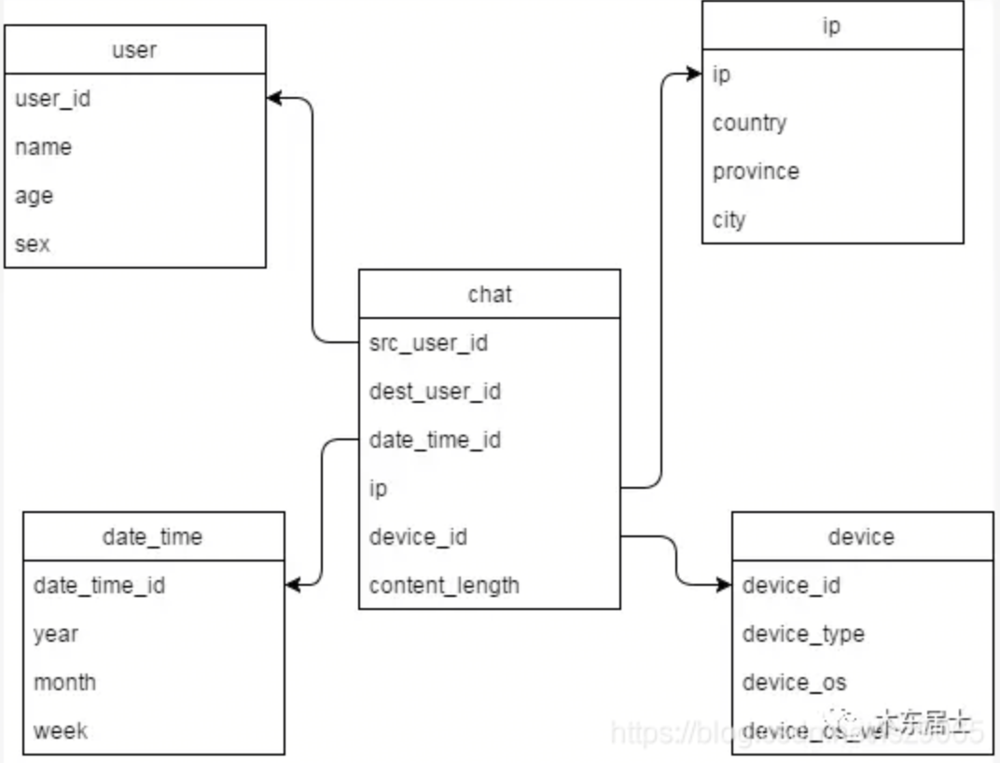
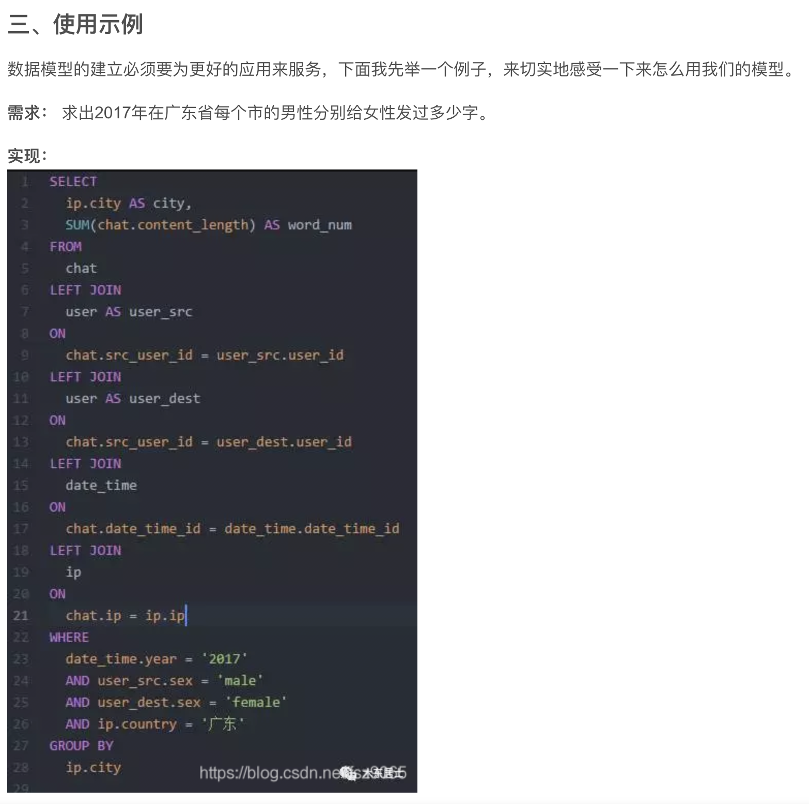

[TOC]
# 详解维度建模
## 什么是维度建模
维度模型是数据仓库领域另一位大师 Ralph Kimball 所倡导，他的《The DataWarehouse Toolkit-The Complete Guide to Dimensona Modeling，中文名《数据仓库工具箱》，是数据仓库工程领域最流行的数仓建模经典。

其中最常用的是星型建模, 下面就星型建模聊一下

## 维度建模中的基本概念
**业务场景**: 聊天！ 比如短信聊天、软件聊天这些聊天场景。 下图是在聊天场景中我们设计的一个简单的星型模型，里面有三个最常用到的概念：事实表、维度表和度量值。

### 事实表
> 发生在现实世界中的操作型事件，其所产生的可度量数值，存储在事实表中。从最低的粒度级别来看，事实表行对应一个度量事件，反之亦然。

回到前面的图，最中间那个chat表就是一个事实表，你可以理解他就是在现实中发生的一次操作型事件，我们每次给一个小伙伴发一条信息，就相当于是一个事实，它在表中的体现就是一条记录。

我们可以回过头再看一下事实表的特征，在维度表里没有存放实际的内容，他是一堆主键的集合，这些ID分别能对应到维度表中的一条记录。

### 维度表
> 每个维度表都包含单一的主键列。维度表的主键可以作为与之关联的任何事实表的外键，当然，维度表行的描述环境应与事实表行完全对应。
维度表通常比较宽，是扁平型非规范表，包含大量的低粒度的文本属性。

我们的图中的围绕在chat表周围的四张表都属于维度表，这些表都有`一个唯一的主键`，然后在表中存放了详细的数据信息。

### 度量值
度量值是什么？看一下chat表中最后一个字段：内容长度（content_length），它表示我们在短信中的发了多少个字。 度量值是对一次行为的度量，可以是一次短信的文本长度、一次电话的通话时间、一个订单的订单金额。

## 实际应用

## 参考地址
[详解维度建模](https://blog.csdn.net/MrZhangBaby/article/details/102689141)