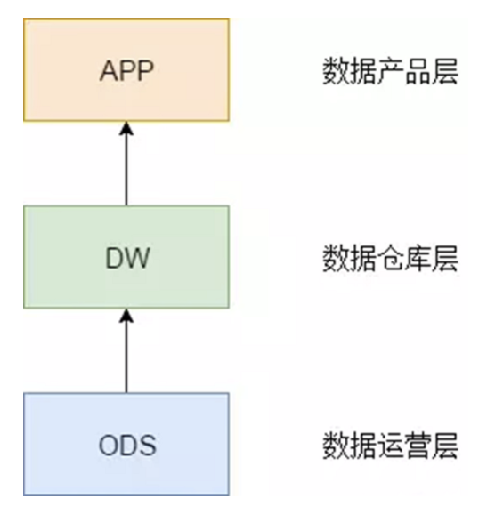
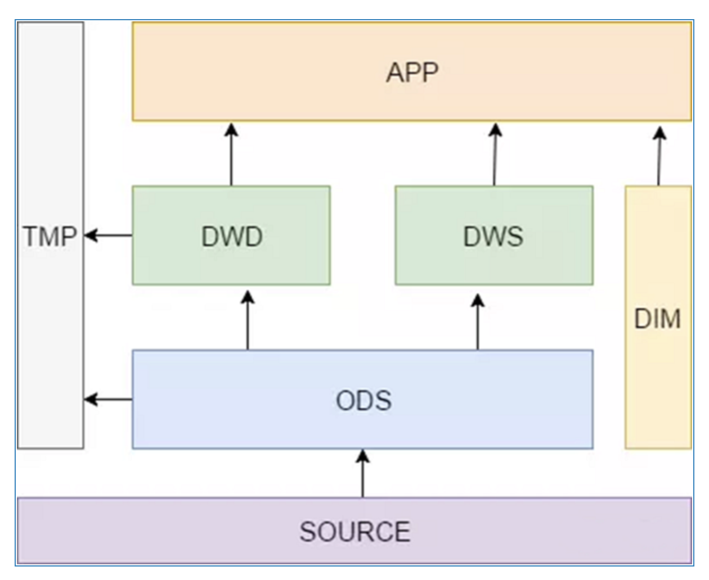

[TOC]
# 如何优雅地设计数据分层？

## 数据为什么需要分层
**数据不分层会有什么问题**
* 数据建设刚起步，大部分的数据经过粗暴的数据接入后就直接对接业务。
* 数据建设发展到一定阶段，发现数据的使用杂乱无章，`各种业务都是从原始数据直接计算而得`。
* 各种`重复计算`，严重浪费了计算资源，需要优化性能。

**分层的原因**
1. **清晰数据结构**：每一个数据分层都有它的作用域，这样我们在使用表的时候能更方便地定位和理解。
2. **数据血缘追踪**：简单来讲可以这样理解，我们最终给业务诚信的是一能直接使用的张业务表，但是它的来源有很多，如果有一张来源表出问题了，我们希望能够快速准确地定位到问题，并清楚它的危害范围。
3. **减少重复开发**：规范数据分层，开发一些通用的中间层数据，能够减少极大的重复计算。
4. **把复杂问题简单化**。讲一个复杂的任务分解成多个步骤来完成，每一层只处理单一的步骤，比较简单和容易理解。而且便于维护数据的准确性，当数据出现问题之后，可以不用修复所有的数据，只需要从有问题的步骤开始修复。
5. **屏蔽原始数据的异常**。
6. **屏蔽业务的影响**，不必改一次业务就需要重新接入数据。
## 怎样分层
### 理论
我们从理论上来做一个抽象，可以把数据仓库分为下面三个层

#### 1. ODS 全称是 Operational Data Store，操作数据存储
“面向主题的”，数据运营层，也叫ODS层，是最接近数据源中数据的一层，数据源中的数据，经过抽取、洗净、传输，也就说传说中的 ETL 之后，装入本层。本层的数据，总体上大多是按照源头业务系统的分类方式而分类的。

但是，这一层面的数据却不等同于原始数据。在源数据装入这一层时，要进行诸如去噪（例如有一条数据中人的年龄是 300 岁，这种属于异常数据，就需要提前做一些处理）、去重（例如在个人资料表中，同一 ID 却有两条重复数据，在接入的时候需要做一步去重）、字段命名规范等一系列操作。

#### 2. 数据仓库层(DW)，是数据仓库的主体
在这里，从 ODS 层中获得的数据按照主题建立各种数据模型。这一层和维度建模会有比较深的联系，可以多参考一下前面的几篇文章。

#### 3. 数据产品层（APP），这一层是提供为数据产品使用的结果数据
在这里，主要是提供给数据产品和数据分析使用的数据，一般会存放在 ES、`Mysql `等系统中供线上系统使用，也可能会存在 Hive 或者 Druid 中供数据分析和数据挖掘使用。 比如我们经常说的报表数据，或者说`那种大宽表，一般就放在ads 层`。

### 技术实践

这里解释一下DWS、DWD、DIM和TMP的作用。

* DWS：轻度汇总层，从ODS层中对用户的行为做一个初步的汇总，抽象出来一些通用的维度：时间、ip、id，并根据这些维度做一些统计值，比如用户每个时间段在不同登录ip购买的商品数等。这里做一层轻度的汇总会让计算更加的高效，在此基础上如果计算仅7天、30天、90天的行为的话会快很多。我们希望80%的业务都能通过我们的DWS层计算，而不是ODS。
* DWD：这一层主要解决一些数据质量问题和数据的完整度问题。比如用户的资料信息来自于很多不同表，而且经常出现延迟丢数据等问题，为了方便各个使用方更好的使用数据，我们可以在这一层做一个屏蔽。
* DIM：这一层比较单纯，举个例子就明白，比如国家代码和国家名、地理位置、中文名、国旗图片等信息就存在DIM层中。
* TMP：每一层的计算都会有很多临时表，专设一个DWTMP层来存储我们数据仓库的临时表。

####  问答一： dws 和 dwd 的关系
问：dws 和dwd 是并行而不是先后顺序?
答：`并行的`，dw 层
问：那其实对于同一个数据，这两个过程是串行的?
答：dws 会做汇总，dwd 和 ods 的粒度相同，这两层之间也没有依赖的关系
问：对呀，那这样 dws 里面的汇总没有经过数据质量和完整度的处理，或者单独做了这种质量相关的处理，为什么不在 dwd 之上再做汇总呢?我的疑问其实就是，`dws的轻度汇总数据结果，有没有做数据质量的处理`?
答：ods 直接到 dws 就好，没必要过 dwd，我举个例子，你的浏览商品行为，我做一层轻度汇总，就直接放在 dws 了。但是你的资料表，要从好多表凑成一份，我们从四五份个人资料表中凑出来了一份完整的资料表放在了 dwd 中。然后在 app 层，我们要出一张画像表，包含用户资料和用户近一年的行为，我们就直接从dwd中拿资料， 然后再在 dws 的基础上做一层统计，就成一个app表了。当然，这不是绝对，dws 和 dwd 有没有依赖关系主要看有没有这种需求。

####  问答二： ods 和 dwd 的区别
问：还是不太明白 ods 和 dwd 层的区别，`有了 ods 层后感觉 dwd 没有什么用了`。
答：嗯，我是这样理解的，站在一个理想的角度来讲，如果 ods 层的数据就非常规整，基本能满足我们绝大部分的需求，这当然是好的，这时候 dwd 层其实也没太大必要。 但是现实中接触的情况是 ods 层的数据很难保证质量，毕竟数据的来源多种多样，推送方也会有自己的推送逻辑，在这种情况下，我们就需要通过额外的一层 dwd 来屏蔽一些底层的差异。

问：我大概明白了，是不是说` dwd 主要是对 ods 层做一些数据清洗和规范化的操作`，dws 主要是对 ods 层数据做一些轻度的汇总?

答：对的，可以大致这样理解。
## 参考地址
[详解维度建模](https://blog.csdn.net/MrZhangBaby/article/details/102690095)